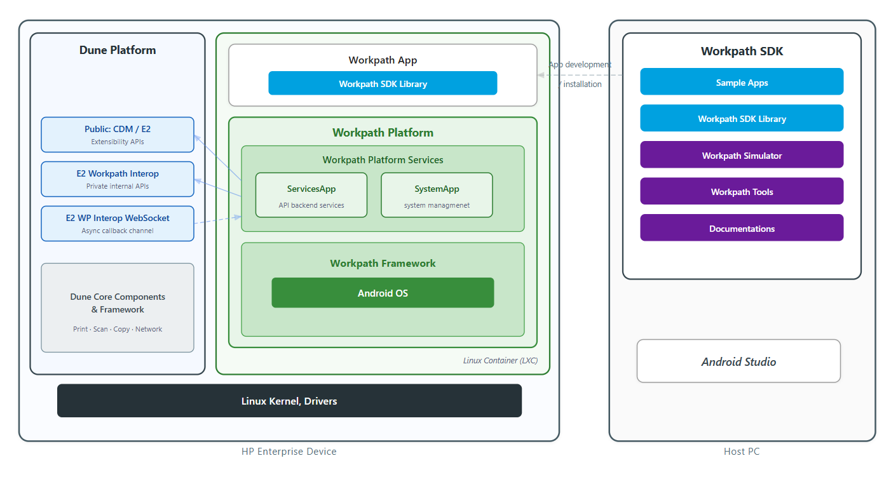

# Workpath Knowledge Base

## HP Workpath Platform & SDK

**HP Workpath** is an extensibility platform for enterprise printers and MFPs, allowing third-party developers to build and run device apps using Android-based tools and technologies. Workpath apps can integrate capabilities such as scanning, printing, copying, authentication, and document workflow on supported HP devices.

This knowledge base covers the two major parts of the HP Workpath:

| Component | Location | Description | KB Link |
|-----------|----------|-------------|---------|
| **Workpath Platform** | Embedded in device firmware | Runtime execution environment inside the printer firmware. Covers platform architecture, communication with Dune firmware, Workpath Services, Workpath System, package management, lifecycle, debugging, and reference material. | [Workpath Platform KB](Workpath_Platform/00_Index.md) |
| **Workpath SDK** | Released on Developer site | SDK release package used to build apps. Covers API library(`WorkpathLib.aar`), sample apps, HPK Tool, simulator, and SDK documentation deliverables. | [Workpath SDK KB](Workpath_SDK_Library/00_Index.md) |

### Architecture Overview

> **Dune Platform** exposes public CDM/E2 APIs and private interop channels used by the Workpath Platform.
>
> **Workpath Platform** runs inside the LXC-based Android environment on the device and contains ServicesApp, SystemApp, and the Workpath Framework.
>
> **Workpath SDK** is the host-side SDK package used to develop, build, package Workpath apps.

---

### Workpath Platform

The **Workpath Platform KB** covers the firmware-embedded runtime environment that implements Workpath platform and services on Dune, including:

- **Concepts** — [Architecture](Workpath_Platform/01_Concepts/Architecture.md), [Platform Services](Workpath_Platform/01_Concepts/Platform_Services.md), [Network Architecture](Workpath_Platform/01_Concepts/Network_Architecture.md), [JOLT vs Dune](Workpath_Platform/01_Concepts/JOLT_vs_Dune.md), and [Glossary](Workpath_Platform/01_Concepts/Glossary.md)
- **Components** — [Workpath Services](Workpath_Platform/02_Components/Workpath_Services.md), [Workpath System](Workpath_Platform/02_Components/Workpath_System.md), [SDK Lib](Workpath_Platform/02_Components/SDK_Lib.md), [Package Manager](Workpath_Platform/02_Components/Package_Manager.md), and [Log Daemon](Workpath_Platform/02_Components/Log_Daemon.md)
- **Guides** — build, debugging, lifecycle, installation, and hardware control flows used by platform developers
- **References** — API signatures, permissions, broadcasts, error codes, and repository mapping

This KB is intended for platform-side development and source-level analysis of the runtime layer that bridges Workpath Apps to Dune firmware services.

**[Go to Workpath Platform KB →](Workpath_Platform/00_Index.md)**

### Workpath SDK

The **Workpath SDK KB** covers the SDK release artifacts distributed to app developers and SDK maintainers. It includes:

- **Overview** — [SDK Package Overview](Workpath_SDK_Library/01_Overview/SDK_Package_Overview.md) and [Release Package Structure](Workpath_SDK_Library/01_Overview/Release_Package_Structure.md)
- **Library & API** — [WorkpathLib](Workpath_SDK_Library/02_Library/WorkpathLib.md), [API Surface](Workpath_SDK_Library/02_Library/API_Surface.md), and [API Patterns](Workpath_SDK_Library/02_Library/API_Patterns.md)
- **Samples** — [Sample Apps Overview](Workpath_SDK_Library/03_Samples/Sample_Apps_Overview.md), [Java Samples](Workpath_SDK_Library/03_Samples/Java_Samples.md), [Kotlin Samples](Workpath_SDK_Library/03_Samples/Kotlin_Samples.md), and [Extensions](Workpath_SDK_Library/03_Samples/Extensions.md)
- **Tools & Docs** — [HPK Tool](Workpath_SDK_Library/04_Tools/HPK_Tool.md), [Simulator](Workpath_SDK_Library/04_Tools/Simulator.md), and [Documentation Guide](Workpath_SDK_Library/04_Tools/Documentation_Guide.md)

This KB is the entry point for understanding how the SDK package is structured, what the library exposes, and how sample apps and tools are delivered.

**[Go to Workpath SDK KB →](Workpath_SDK/00_Index.md)**

---

> **SDK Version**: HP Workpath SDK v1.6.3  
> **Platform**: Dune (Future Smart 6) — Android 12 (API 31)
