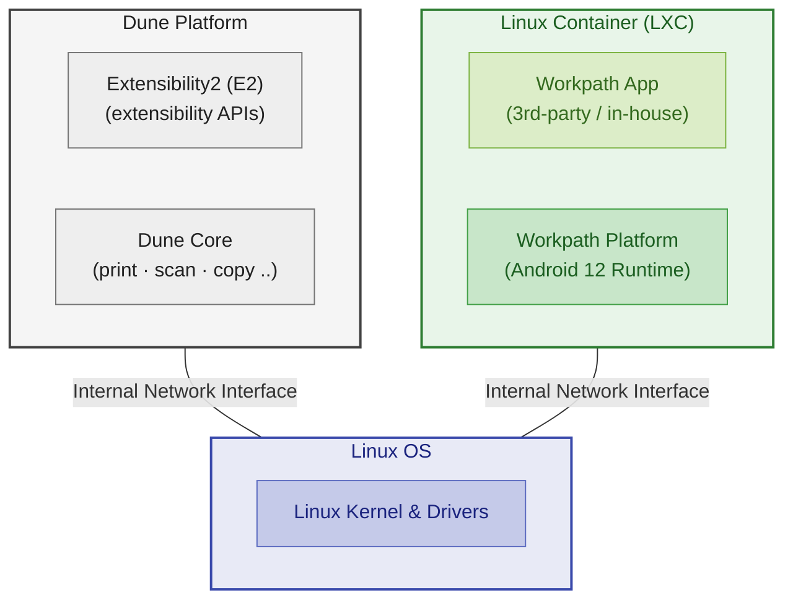
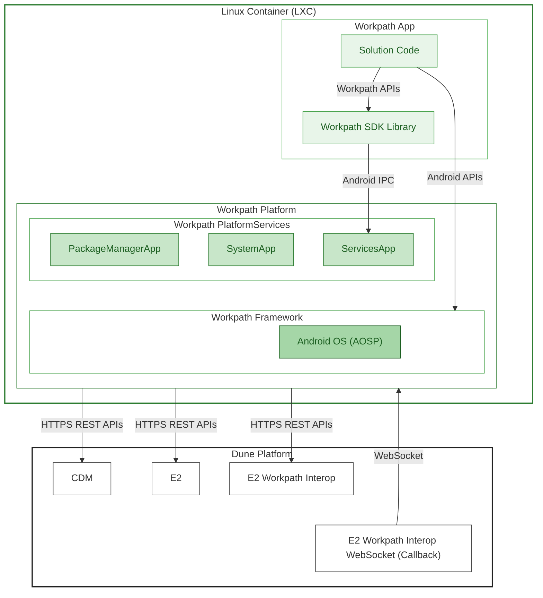
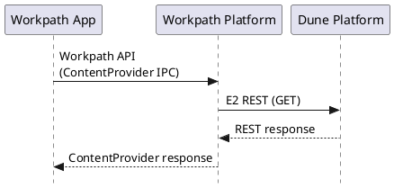
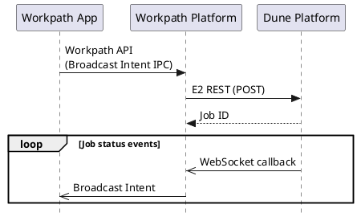
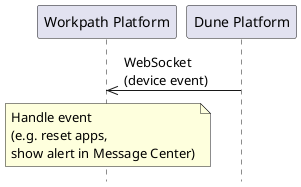
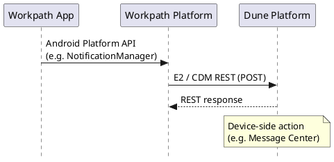

# HP Workpath Platform Architecture for Dune (FutureSmart6)

## 1. Workpath Platform Architecture

HP Workpath Platform is an extensibility platform embedded within HP enterprise printers, scanners, and copiers that exposes device capabilities — print, scan, copy, and more — as programmable services. It provides a managed application runtime that allows third-party workflow applications to run directly on the device and be launched from the device's control panel, enabling customers to extend and customize printer functionality without requiring a separate host computer.

### 1.1 Architectural Foundation and Runtime Environment

The Workpath Platform on both Jolt (FS5) and Dune (FS6) shares a common architectural foundation. It runs within an Android 12 (AOSP) userspace isolated inside a Linux Container (LXC). The container is shipped as part of the device firmware bundle and has the following runtime characteristics:

- **SELinux enforcement**: Access control within the container is enforced by SELinux mandatory access control.
- **CPU architecture**: 32-bit Android userspace running on a 64-bit Linux kernel.
- **Memory limit**: 1.25 GB RAM cap enforced by cgroups.

The diagram below illustrates the runtime environment of the Workpath Platform. Two independent execution domains — the **Dune Platform** (native firmware) and the **Linux Container** (Workpath runtime) — run on top of a shared Linux kernel.

- **Dune Platform** — The Dune platform (externally branded as HP FutureSmart 6, or FS6 for enterprise products) is the unified firmware platform for HP printers and MFPs. Dune Core drives the device's core functions (print engine, scan pipeline, network stack, etc.), while Extensibility2 (E2) exposes the firmware's extensibility APIs for external integration.
- **Linux Container (LXC)** — A sandboxed container isolated by SELinux and memory-capped by cgroups. Inside the container, Android (AOSP) hosts the Workpath Platform, which abstracts device capabilities into a set of APIs. Third-party Workpath Apps invoke these APIs to implement workflow solutions.
- **Linux OS** — The shared 64-bit Linux kernel and hardware drivers underlying both execution domains.

The two domains share the kernel but are otherwise fully isolated; all inter-domain communication traverses an internal network interface.

---
### 1.2 Component Architecture

The component architecture spans two execution domains: the **Linux Container (LXC)** and the **Dune Platform**. The hierarchy below follows the containment relationships shown in the diagram.

- **Linux Container (LXC)** for Workpath
    - **Workpath App**: Third-party or in-house Android application running as an isolated process inside the container.
        - **Solution Code**: Application-specific UI, Activities, Services, and business logic.
        - **Workpath SDK Library**: A Java library distributed as part of the Workpath SDK to third-party developers. Bundled into the app at app build time, it exposes the Workpath API surface to solution code and proxies all calls to the Workpath Platform via IPC. Contains no business logic of its own.
    - **Workpath Platform**: Shared runtime environment that hosts Workpath apps and provides common platform services.
        - **Workpath Framework**: The AOSP-based Android OS layer that provides the Android Runtime (ART) and Android Java API framework (Activity, Intent, UI, etc.) to Workpath Apps. For the Android platform internal architecture, refer to https://developer.android.com/guide/platform.
        - **Workpath Platform Services**: A set of pre-installed apps that run on top of the Workpath Framework and provide core platform services—managing the app lifecycle, package installation, and Workpath API exposure—enabling key Workpath capabilities for third-party developers.
            - **Workpath `SystemApp`**: Manages Workpath platform startup, app launch and reset, UI screen transitions between Workpath and Dune, and license enforcement.
            - **Workpath `PackageManagerApp`**: Manages application installation, removal, and metadata persistence in coordination with the Dune E2 Solution Manager.
            - **Workpath `ServicesApp`**: Hosts Workpath API services such as `AccessService`, `DeviceService`, `ScannerService`, `PrinterService`, and `CopierService` over Android IPC.

- **Dune Platform**
    - **CDM (Common Data Model) APIs**: Public device service layer for common resources, configuration data, and device information.
    - **E2 (Extensibility2 / OXPd2) APIs**: Public device extensibility framework through which solutions consume solution-facing device services.
    - **E2 Workpath Interop**: Private internal API surface for Workpath-specific firmware integration.
    - **E2 Workpath Interop WebSocket**: Private event channel used by the firmware to push asynchronous notifications to the Workpath Platform and apps.

> **Note**: When the Workpath Platform needs to interact with the Dune platform, it follows an API selection priority: if a suitable E2 API or CDM API is already available, that standard interface is used. If no suitable standard interface exists, a dedicated E2 Workpath Interop API is developed exclusively for the Workpath Platform's use. The preference order is: **E2 → CDM → E2 Workpath Interop** (i.e., prefer public standard APIs over private internal ones).

---
### 1.3 Inter-Component Interfaces

This section summarizes the primary communication boundaries between the major architectural layers.

#### 1.3.1 App ↔ Workpath Platform

| Interface | Mechanism | Purpose | Access Control |
|---|---|---|---|
| Workpath SDK API | Java interfaces exposed through the Workpath SDK library and implemented over Android IPC mechanisms such as Content Providers, Broadcasts, bound services, and AIDL. All APIs are documented in JavaDoc format and published as part of the Workpath SDK. Categorized service APIs include AccessService, DeviceService, ScannerService, PrinterService, and CopierService. | Provides app access to Workpath platform services and device-specific capabilities | Permission checks and Binder‑based UID/PID verification enforced by Android |
| Android Java API | Android Java API framework provided by AOSP | Supports standard Android application development within the Workpath runtime | Standard Android application security model |

#### 1.3.2 Workpath Platform ↔ Dune Platform

All communication between the Workpath Platform and the Dune platform traverses the internal network interface.

| Interface | Protocol / Format | Purpose | Visibility | Access Control |
|---|---|---|---|---|
| CDM APIs | HTTPS REST / JSON | Accesses public device resources such as configuration data, installed solution licenses, and other device-level information | Public firmware API | Bearer-token authorization |
| E2 APIs | HTTPS REST / JSON | Provides the primary solution-facing interface used by the Workpath Platform on behalf of apps | Public firmware API | Bearer-token authorization |
| E2 Workpath Interop APIs | HTTPS REST / JSON | Provides private internal integration endpoints for Workpath-specific control and status operations | Private internal API | Bearer-token authorization |
| E2 Workpath Interop WebSocket | WebSocket | Provides a persistent channel for asynchronous notifications and callback events from the Dune platform to the Workpath Platform | Private internal channel | Bearer-token authorization |

---
## 2. Application Lifecycle

### 2.1 Deployment

Third-party Workpath Apps are subject to HP's verification and validation (V&V) process before distribution. Once approved, apps are signed with an HP key and published through the HP App Center.

### 2.2 Installation

Apps can be installed, updated, or removed on the device through two channels:

- **Cloud-based**: via the Workpath Cloud Portal (WXP)
- **Sideloading**: via USB, the Embedded Web Server (EWS), or a dedicated management tool

Regardless of the installation channel, the front-end entry point on the device is the **E2 Solution Manager** service running in the Dune platform. During installation, the Workpath `PackageManagerApp` retrieves the APK from the E2 Solution Manager and installs it into the Android runtime.

The internal installation sequence on the device proceeds as follows:

1. **Solution Bundle Verification and Extraction** — E2 Solution Manager validates and unpacks the solution bundle.
2. **Solution Resource Creation** — E2 Solution Manager creates the necessary E2 resources for the solution.
3. **Solution Platform Package Processing** — The Workpath `PackageManagerApp` retrieves the APK from E2 Solution Manager and installs it into the Android runtime.
4. **Solution Service Registration** — Each E2 service handler registers the required E2 service agents according to the solution manifest.
5. **Finalization and Cleanup** — E2 Solution Manager completes the process and performs any necessary cleanup.

Upon completion of the installation sequence, the Workpath `PackageManagerApp` collects the registered app's metadata and persists it to its internal database.

### 2.3 Runtime

Workpath `SystemApp` is responsible for enabling or disabling installed apps based on their license validity. Only apps with a valid license are made available to users.

An enabled app can be launched through any of the following mechanisms:

- **UI-initiated**: The user selects the app's icon on the device's control panel touchscreen.
- **Broadcast-driven**: The app has registered a Broadcast Receiver for one or more predefined Workpath broadcast events, and the Workpath Platform dispatches a matching broadcast.
- **ObserverService-driven**: The app has implemented and registered an observer service defined in the Workpath API, and the Workpath Platform starts that service in response to a relevant event.
- **App-to-app**: Another installed app explicitly launches the target app.

Once running, applications execute within the LXC container's resource constraints and follow the standard Android Activity lifecycle as managed by the Android Framework.

---
## 3. Runtime Communication Patterns

At runtime, the interfaces described in [Section 1.3](#13-inter-component-interfaces) combine into the following communication patterns.

#### Pattern 1: Synchronous Request–Response

Used for stateless queries such as retrieving device status or capabilities. The App calls a Workpath API via **ContentProvider** IPC, the Workpath Platform forwards it as an **E2 REST** request, and returns the response synchronously.

#### Pattern 2: Job Submit and Callback

Used for long-running device operations such as scan or copy. The App submits a job via **Broadcast Intent** IPC, the Workpath Platform creates the job through **E2 REST**, and then receives asynchronous job-status events over the **WebSocket**, which it relays back to the App as **Broadcast Intents**.

#### Pattern 3: Device Event Push

Used when the Dune Platform raises a device-level event (e.g., power-level change, low toner, paper jam, door open). The firmware pushes the event over the **WebSocket** to the Workpath Platform, which handles it accordingly — for example, resetting apps or rendering alert messages in the **Message Center** on the Workpath screen.

#### Pattern 4: Android Platform API with Device Integration

Used when an App invokes a standard **Android Platform API** that is integrated with device features. The App calls the Android API (e.g., `NotificationManager`) and the change is applied to the Android framework as usual. The Workpath Platform observes the resulting state change, translates it into an **E2 / CDM REST** request, and forwards it to the Dune Platform, which carries out the corresponding device-side action (e.g., displaying the notification in the device **Message Center**).

---
## 4. Security Model

The Workpath Platform enforces security at multiple boundaries across the architecture.

### 4.1 Container Isolation

The Android runtime is isolated within an LXC container. SELinux mandatory access control governs process interactions within the container, and cgroups enforce the 1.25 GB memory cap. See [Section 1.1](#11-architectural-foundation-and-runtime-environment) for runtime characteristics.

### 4.2 Network Boundary

Both the Workpath Platform and Workpath Apps inside the LXC container can reach external networks through the container's network interface. However, direct access to the Dune Platform's internal network interface is restricted to the Workpath Platform only — Workpath Apps cannot communicate with the Dune Platform directly and must go through the Workpath Platform's API surface.

### 4.3 App ↔ Workpath Platform

Access to Workpath APIs is mediated by Android's Binder IPC mechanism. The Workpath Platform enforces UID/PID-based caller identity and requires declaration of specific Workpath permissions for sensitive APIs. See [Section 1.3.1](#131-app--workpath-platform) for interface details.

### 4.4 Workpath Platform ↔ Dune Platform

Access to CDM and E2 APIs is governed by the security model defined by each service. The Workpath Platform must present a valid bearer access token with every API request. Three token types are used, each with a distinct purpose and lifecycle:

| Token | Purpose | Lifecycle | Refresh |
|---|---|---|---|
| Workpath access token | Platform-internal CDM/E2 calls, WebSocket authorization | Acquired by SystemApp on boot via OAuth 2.0 client credentials grant | Re-acquired on expiry |
| Solution access token | E2 service agent calls on behalf of a specific app | Issued per app when a Workpath App session begins | Cached; pre-emptively refreshed before expiry |
| UI context token | Job-creation operations (scan, copy) | Issued when an app gains the foreground screen; invalidated on screen transition | Not refreshed; new token per screen session |

On a **401 Unauthorized** response, the platform attempts an immediate token refresh and retries the request. If the refresh fails, the error propagates to the app as an SDK exception. On a **device reboot**, all tokens are discarded and re-acquired through the normal boot sequence.

### 4.5 Application Trust

**Installation**: Only apps signed with an HP key are permitted to install in production. Apps are signed after passing HP's verification and validation (V&V) process and are distributed through the HP App Center.

**License enforcement**: Only apps with a valid license are enabled by `SystemApp` and made available to users.

> **Development mode exception**: When the LaserJet Debug Bridge is enabled on the device, both signing verification and license enforcement are bypassed, allowing unsigned and unlicensed apps to be installed and tested during development.
