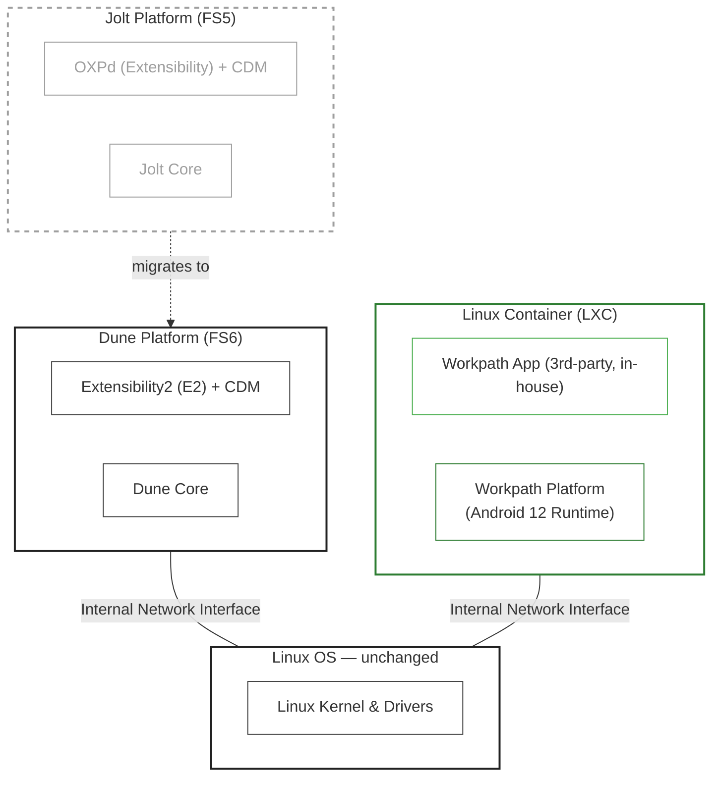

# JOLT vs Dune — Migration

## 1. Overview

This document compares the HP Workpath platform architecture between **Jolt (FS5)** and **Dune (FS6)**, highlighting what remains consistent and what has changed, to guide platform developers through the migration.

## 2. Architecture Comparison

### 2.1 What Remains the Same

1. **Architectural Foundation and Runtime Environment** — The Workpath Platform's architectural foundation and runtime environment, as described in [Architecture.md Section 1.1](./Architecture.md#11-architectural-foundation-and-runtime-environment), is identical between Jolt and Dune. Both platforms run Android 12 (AOSP) inside an LXC container on top of a shared Linux kernel, with the same SELinux enforcement, CPU architecture, and memory constraints.

2. **Workpath SDK Library and API Surface** — The Workpath SDK Library and Workpath API surface exposed to third-party apps are identical between Jolt and Dune. The goal is to support binary-compatible migration, so that existing APKs built for Jolt can run on Dune without requiring a rebuild.

### 2.2 What Has Changed

1. **Firmware Interaction** — The firmware domain changes from Jolt (JEDI/OXPd) to Dune (E2/CDM). As a result, all backend interactions between the Workpath Platform and the firmware platform must be re-implemented to target the Dune E2 and CDM APIs.

2. **App Installation** — All external endpoints are now hosted by the Dune E2 framework; the Workpath Platform no longer exposes external-facing endpoints of its own. Consequently, the app installation model has changed: in Jolt, the Workpath Platform provided the installation endpoint and managed the app installation process directly. In Dune, the Dune E2 Solution Manager provides the installation endpoint, orchestrates the entire installation process, and registers all apps within the Dune E2 framework. The Workpath platform participates only in the APK installation step, in coordination with the E2 Solution Manager.

3. **App Bundle Packaging Format** — The app bundle packaging format changes from `.hpk` to `.hpk2`. The two formats are not compatible, so existing apps must be repackaged in the new format. However, the APK inside the bundle remains unchanged and does not need to be rebuilt.

## 3. Detailed Comparison

### 3.1. Workpath Structure

| Aspect | Jolt (FS5) | Dune (FS6) |
|---|---|---|
| **Workpath App** | 3rd party apps, in-house apps | No change |
| **Workpath SDK Library** | 1.6.3 | No change |
| **Workpath Platform Services** | 6 pre-installed APKs | Restructured into 4 pre-installed APKs |
| **Workpath Framework** | Android 12 (AOSP) | No change |

### 3.2. Communication Protocols

| Aspect | JOLT (FS5) | Dune (FS6) |
|---|---|---|
| **App → Workpath Platform IPC** | Workpath API | No change |
| **Workpath Platform → Firmware** | OXPd , ControlPanel REST API, Internal CDM | E2 REST API, Public CDM API, E2Interop API |
| **Firmware → Workpath Platform** | Multiple WebSocket connections | E2Interop WebSocket (dedicated callback channel) |

### 3.3. Source Code Repositories for Workpath Platform services and SDK

| Component | JOLT Repository | Dune Repository |
|---|---|---|
| System App | [`system_service`](https://github.azc.ext.hp.com/system/system_service) | [`System-dune`](https://github.azc.ext.hp.com/workpath-dune/System-dune) |
| Services App | [`linksdk`](https://github.azc.ext.hp.com/sdk/linksdk) | [`workpath-services-dune`](https://github.azc.ext.hp.com/workpath-dune/workpath-services-dune) |
| Package Manager | [`linkpackagemanager`](https://github.azc.ext.hp.com/sdk/linkpackagemanager) | [`packagemanager-dune`](https://github.azc.ext.hp.com/workpath-dune/packagemanager-dune) |
| Log Daemon | [`LogDaemon`](https://github.azc.ext.hp.com/system/LogDaemon) | [`LogDaemon-dune`](https://github.azc.ext.hp.com/workpath-dune/LogDaemon-dune) |
| Web Service App | [`linkbus`](https://github.azc.ext.hp.com/sdk/linkbus) | Merged into ServicesApp |
| Data Collector | [`linkdatacollector`](https://github.azc.ext.hp.com/sdk/linkdatacollector) | Removed (no longer needed) |

SDK Repository : common for both Jolt and Dune
| Component | Repository | Description |
|---|---|---|
| SDK Library | [`linksdklib`](https://github.azc.ext.hp.com/sdk/linksdk) | Repository containing the source code for the Workpath SDK libraries. |
| Java Sample Apps | [`linksdk_next_samples`](https://github.azc.ext.hp.com/sdk/linksdk_next_samples) | Repository containing Java sample application source code for the Workpath SDK. | 
| Java Sample Apps | [`linksdk_next_kotlin`](https://github.azc.ext.hp.com/sdk/linksdk_next_kotlin) | Repository containing Kotlin sample application source code for the Workpath SDK. | 
| Simulator | [`simulator`](https://github.azc.ext.hp.com/sdk/simulator) | Repository containing the source code and related resources for the Workpath SDK simulator. (Jedi/Jolt OXPd based simulator) |
| SDK Release | [`WorkpathRelease`](https://github.azc.ext.hp.com/sdk/WorkpathRelease) | Repository containing Workpath SDK release assets, including API Javadoc, technical documentation, libraries, Java and Kotlin sample apps, development tools, and simulator resources. | 

### 3.4. Security Model

| Aspect | JOLT (FS5) | Dune (FS6) |
|---|---|---|
| **Container Isolation** | LXC container enforced by SELinux mandatory access control | No change |
| **Network Boundary** | Firmware internal network isolated from apps; Platform-only access | No change |
| **App ↔ Workpath Platform** | Binder IPC; UID/PID-based caller identity enforced | No change |
| **Workpath Platform ↔ Dune Platform** | Internal network | Internal network + bearer access token |
| **Application Trust** | HP-signed apps only (HP V&V process required); distributed via HP App Center; license enforced at runtime | No change |

## 4. SDK API Backward Compatibility Impact

### Preserved
**The WorkpathLib API surface is identical across JOLT and Dune.** The same `WorkpathLib.aar` (`Workpath`, `ScannerService`, `PrinterService`, etc.) works on both platforms. This is by design — the SDK API library is a thin client, and the platform-side implementation handles the protocol difference (JEDI vs. E2).

