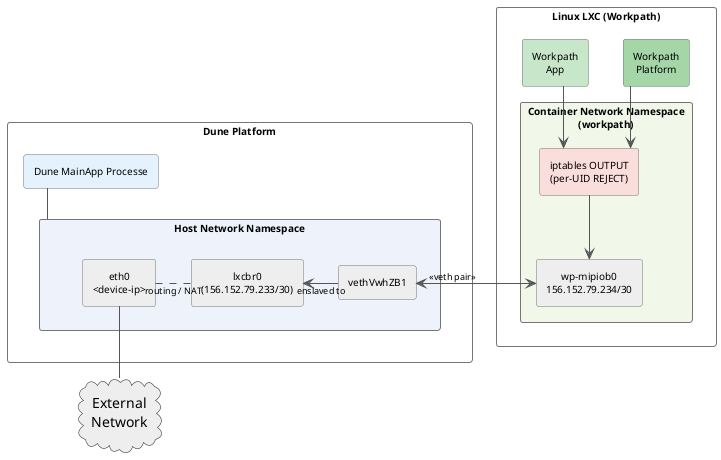
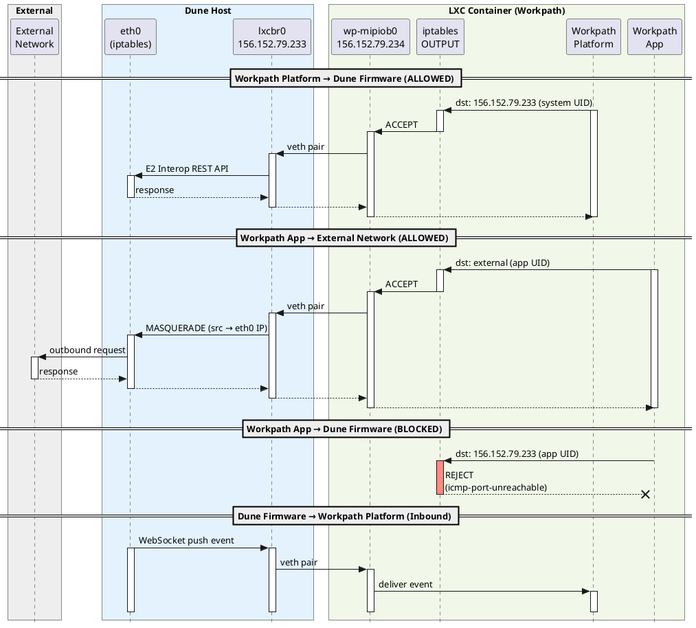

# Workpath Network Architecture (Dune)

This document describes the internal network architecture of the Workpath platform on the **Dune (FS6)** platform, which runs inside a Linux Container (LXC) on the device.

---

## 1. Network Topology Overview

The Workpath runtime runs inside a **Linux Container (LXC guest)** on the **Dune Linux host**. The host and the container are connected via `lxcbr0` (LXC bridge) and a veth pair (`vethVwhZB1@if9` ↔ `wp-mipiob0@if6`). The Workpath Platform can reach the host's internal bridge address (`156.152.79.233` = `fwprinter2` = `lxcbr0`) directly as the destination, enabling communication with Dune firmware services (e.g., E2 Interop REST API). Workpath Apps, however, are blocked from this destination — the container's **guest iptables OUTPUT chain** applies per-UID filtering and REJECTs traffic to `156.152.79.233` from non-whitelisted UIDs. Workpath Apps can still reach external networks; outbound packets are routed through the host's `eth0` interface where iptables MASQUERADE performs source NAT.

The host and the container share a single `/30` subnet:

1. **Host ↔ Container** (`156.152.79.233`–`.234`, `/30`): `lxcbr0` (`.233`, bridge) on the host connects to `wp-mipiob0` (`.234`) in the container via a **veth pair** (`vethVwhZB1@if9` ↔ `wp-mipiob0@if6`).
2. The container network namespace has **only one kernel route**: `156.152.79.232/30 dev wp-mipiob0`. There is no default route. Traffic to destinations outside this subnet requires higher-layer handling (e.g., Android `netd` within the container).
3. External inbound access into the container is **not available** — only LDB port `5555` is forwarded via iptables DNAT if LDB is enabled on the device.

### 1.1 Network Interfaces

| Interface | Location | IP | Subnet | Role |
|---|---|---|---|---|
| **eth0** | Linux Host | {device-ip} | {subnet} | Physical NIC; external network access |
| **lxcbr0** | Linux Host | `156.152.79.233` | `/30` | LXC bridge; gateway address for the container |
| **vethVwhZB1** | Linux Host | — | — | veth host-side (if9), attached to `lxcbr0` |
| **wp-mipiob0** | LXC Container | `156.152.79.234` | `/30` | veth container-side (if6); communicates with host via `.233` |

---

## 2. Routing Tables

### 2.1 Host Routing Table

| Destination | Dev | Description |
|---|---|---|
| `default` via `15.26.176.10` | `eth0` | Default gateway to external network |
| `15.26.176.0/20` | `eth0` | External subnet (DHCP) |
| `156.152.79.232/30` | `lxcbr0` | LXC container subnet |

### 2.2 Container Routing Table

| Destination | Dev | Description |
|---|---|---|
| `156.152.79.232/30` | `wp-mipiob0` | Local subnet only — no default route |

The container has **no default route** at the kernel level. Traffic from the container to Dune firmware services or external networks relies on higher-layer handling within the Android runtime (e.g., `netd`), with host iptables MASQUERADE handling the NAT for outbound packets.

---

## 3. Host iptables NAT Rules

### PREROUTING

| In | Protocol | Source | Dest | Action | Purpose |
|---|---|---|---|---|---|
| `eth0` | TCP | any | any | DNAT → `156.152.79.234:5555` | LDB (ADB) inbound from external |
| `lxcbr0` | UDP | `156.152.79.234` | any dpt:53 | DNAT → `127.0.0.1:53` | Container DNS → host resolver |
| `lxcbr0` | UDP | `156.152.79.234` | any dpt:161 | DNAT → `127.0.0.1:161` | Container SNMP → host |

### POSTROUTING

| Out | Source | Action | Purpose |
|---|---|---|---|
| `eth0` / `eth1` / `wifi0` | `156.152.79.234` | MASQUERADE | Container → external network (outbound NAT) |

---

## 4. Access Control Summary

| Traffic Path | Allowed | Mechanism |
|---|---|---|
| Workpath Platform → (`156.152.79.233`) | Yes | Guest iptables OUTPUT: system UIDs ACCEPT |
| Workpath App → (`156.152.79.233`) | **No** | Guest iptables OUTPUT: REJECT (icmp-port-unreachable) |
| Workpath App / Platform → External network | Yes | MASQUERADE (POSTROUTING, out: eth0/eth1/wifi0) |
| Workpath container → host DNS/SNMP | Yes | PREROUTING DNAT → `127.0.0.1:53/161` |
| External → container port 5555 (LDB) | Yes (LDB mode only) | PREROUTING DNAT (in: eth0) |
| External → container (other ports) | **No** | No DNAT rules |

---

## 5. Traffic Flow Summary

