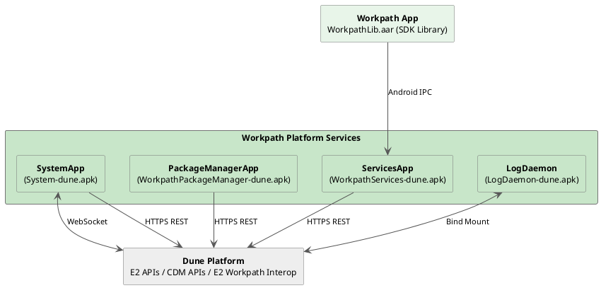
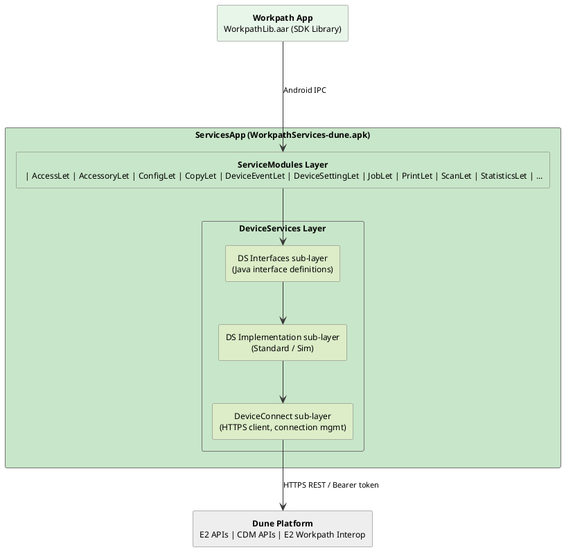
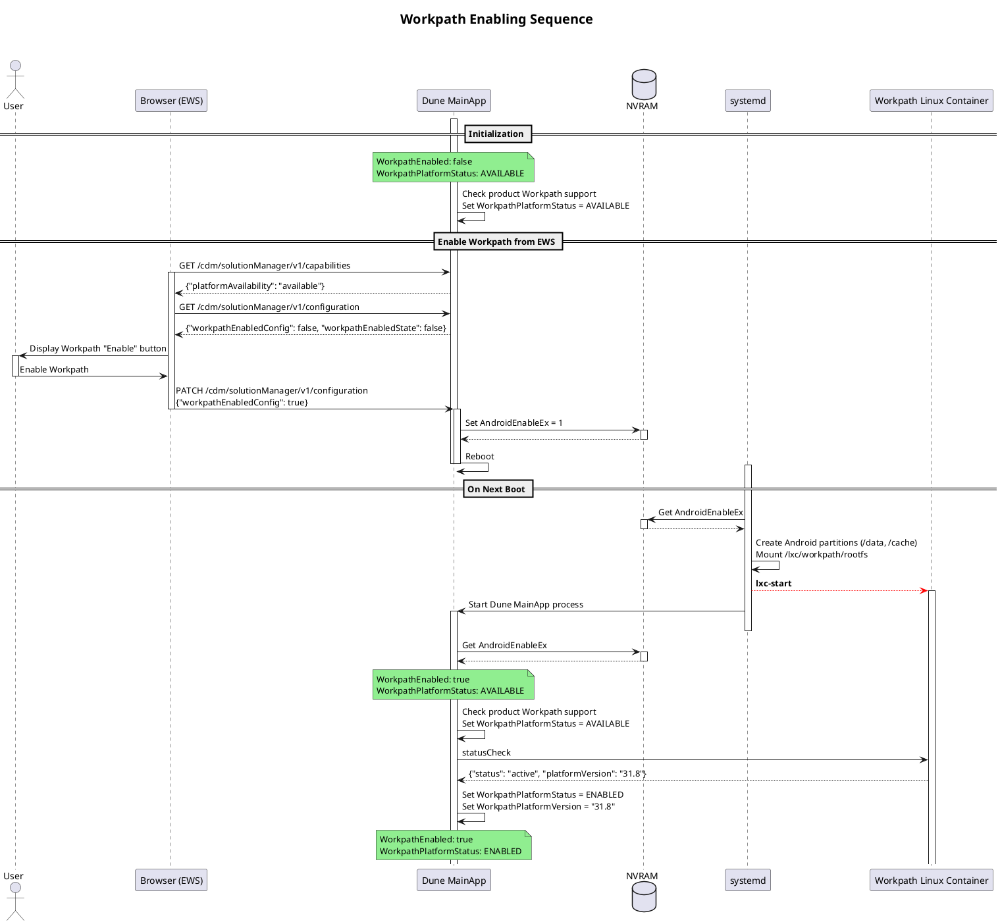
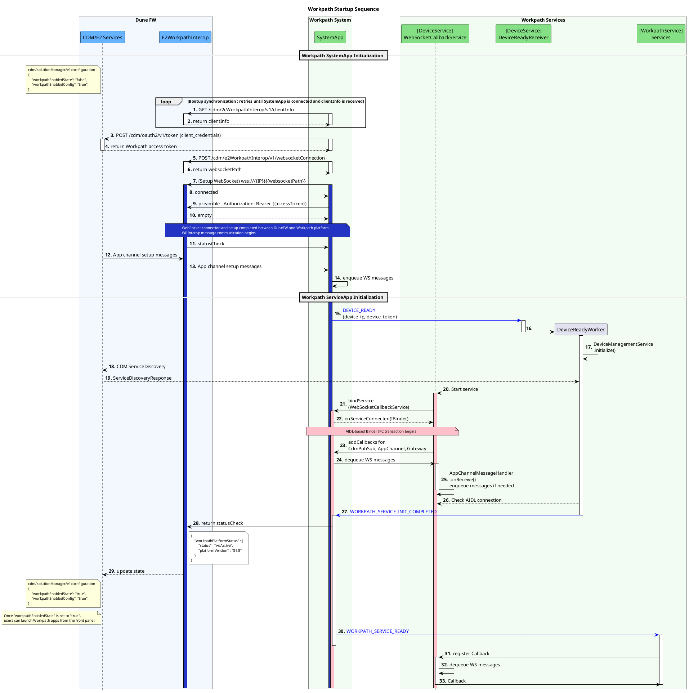

# Workpath Platform Services

## Overview

**Workpath Platform Services** are a set of pre-installed privileged apps that provide the Workpath platform's core services within the Android runtime environment, including system services (platform startup and system management), package management services (app installation and removal), and Workpath SDK API services (implementing and exposing Workpath SDK APIs to third-party apps over Android IPC, and translating those SDK calls into firmware API requests to the Dune platform).

> **Relationship to Architecture.md**: Workpath Platform Services correspond to the **Workpath Platform Services** sub-layer inside the Workpath Platform described in [Architecture.md Section 1.2](./Architecture.md#12-component-architecture).

| App | APK | Primary Responsibility |
|---|---|---|
| **SystemApp** | `System-dune.apk` | Platform boot, App launch, screen switching, license enforcement |
| **PackageManagerApp** | `WorkpathPackageManager-dune.apk` | APK installation, APK verification, App lifecycle |
| **ServicesApp** | `WorkpathServices-dune.apk` | Workpath SDK API services implementation |
| **LogDaemon** | `LogDaemon-dune.apk` | Workpath Log management for both platform and apps |

---

## 1. Pre-installed Apps for Workpath Platform Services

---

### 1.1 SystemApp

**Package**: `com.hp.jetadvantage.link.system` | **APK**: `System-dune.apk`

SystemApp is a system-privileged app. It is the first Workpath component to start, triggered by the `BOOT_COMPLETED` broadcast from the Android OS.

| Responsibility | Description |
|---|---|
| **Boot orchestration & platform readiness** | Receives `BOOT_COMPLETED`, initializes the startup sequence, and updates the platform readiness signal to Dune |
| **E2 WebSocket bridge** | Maintains a persistent WebSocket connection to Dune firmware for asynchronous event callbacks |
| **Screen switching** | Manages transitions between the Dune control panel UI and the Android (Workpath) UI |
| **License enforcement** | Validates app licenses; enables or disables installed apps accordingly |
| **Locale & time sync** | Synchronizes Android locale and system clock with printer firmware |

### 1.2 ServicesApp

**Package**: `com.hp.jetadvantage.link.services` | **APK**: `WorkpathServices-dune.apk`

ServicesApp is the API backend of the Workpath Platform. It implements Workpath APIs, communicating with the App (via `WorkpathLib.aar`) over Android IPC (`ContentProvider`, `BroadcastReceiver`, Bound Service with AIDL Binder), and translates each SDK call into one or more HTTPS REST calls to the Dune Platform's E2 or CDM APIs.

| Responsibility | Description |
|---|---|
| **Workpath SDK API implementation** | Implements Workpath SDK APIs, receiving requests from `WorkpathLib.aar` via Android IPC (`ContentProvider`, `BroadcastReceiver`, Bound Service with AIDL Binder) |
| **Hosting Workpath services** | Hosts ServiceLet modules (`ScanLet`, `PrintLet`, `CopyLet`, `DeviceLet`, etc.), each implementing a specific device capability category |
| **Firmware API proxy** | Translates each SDK call into HTTPS REST requests to the Dune E2 or CDM APIs for accessing resources of the device, authenticated via Bearer access token |

### Internal Layered Architecture
The internal structure of ServicesApp follows a layered architecture. The Service Module Layer, composed of individual ServiceLet modules, receives and processes service-specific requests from the App. Beneath it, the DeviceServices Layer connects to the device and abstracts the device’s resources, and manages solution access tokens for each app to access its dedicated E2 service agents and resources.

### 1.3 PackageManagerApp

**Package**: `com.hp.jetadvantage.link.packagemanager` | **APK**: `WorkpathPackageManager-dune.apk`

PackageManagerApp handles the installation, verification, and removal of Workpath Apps on the device. In previous platforms (Jedi/Jolt), PackageManagerApp provided the endpoint for app installation. However, in Dune, the Dune E2 Solution Manager service provides the endpoints for both E2 solution and Workpath app installation and removal, orchestrates the entire app installation process, and performs signing and bundle verification for app bundles (.hpk2). As a result, the role of Workpath PackageManagerApp in Dune is reduced to collaborating with the E2 Solution Manager and handling only the APK installation step within the overall process.

| Responsibility | Description |
|---|---|
| **APK installation** | Receives an install notification from E2 Solution Manager and installs the APK via Android `PackageManager` |
| **Signature verification** | Verifies the cryptographic signature of each APK  |
| **Metadata persistence** | Stores installed app metadata in its internal database |
| **Solution lifecycle** | Coordinates update and removal operations with E2 Solution Manager |

### 1.4 LogDaemonApp

**Package**: `com.hp.jetadvantage.link.logdaemon` | **APK**: `LogDaemon-dune.apk`

LogDaemon is a background service responsible for collecting and forwarding log output from the Workpath platform and all Workpath Apps to the Dune firmware side when requested.

| Responsibility | Description |
|---|---|
| **Log collection** | Collects log output from Workpath platform components and installed Workpath Apps |
| **Log forwarding** | Writes collected logs to a shared directory exposed to the Dune platform via bind mount |
| **Log lifecycle management** | Manages log rotation and retention to prevent storage exhaustion |

---
## 2. Workpath Platform Enablement Sequence

Before Workpath Apps can run on a device, the Workpath platform must be explicitly enabled by an administrator. The enablement is a one-time process: the administrator enables Workpath through the Embedded Web Server (EWS), the Dune firmware persists the setting to NVRAM and reboots the device. On the subsequent boot, `systemd` detects the flag, creates the necessary Android partitions, and starts the Workpath Linux Container (LXC). Once the container is active, the Dune platform verifies its status and marks the Workpath platform as **ENABLED**.

---
## 3. Boot & Initialization Sequence

The startup sequence is **SystemApp-driven**: SystemApp initializes first to sync with Dune E2, then triggers the initialization of all other platform components by broadcasting `DEVICE_READY`.

1. **SystemApp Initialization** — On `BOOT_COMPLETED`, SystemApp retrieves the Workpath access token from the Dune CDM, then establishes a persistent WebSocket connection to the E2 Workpath Interop service. Once the WebSocket is active, SystemApp broadcasts `DEVICE_READY` to all platform components. After receiving `WORKPATH_SERVICE_INIT_COMPLETED` back from ServicesApp, it reports the platform status back to Dune (`workpathEnabledState: true`) over the WebSocket, which signals that the Workpath platform is ready and allows Workpath apps to be launched from the front panel.

2. **Other Pre-installed Apps Initialization** — On receiving `DEVICE_READY` from SystemApp, ServicesApp, PackageManagerApp, and LogDaemonApp each start their own initialization in parallel. During initialization, each app connects to the SystemApp WebSocket relay via AIDL Binder IPC to receive callbacks from Dune/E2. 

**Note**: For the LXC container start flow, refer to the internal Confluence page: [1-b. Android enable/disable on Tron — GS2.0 Tron Booting](https://rndwiki.inc.hpicorp.net/confluence/spaces/GUIC/pages/1260507290/1-b.+Android+enable+disable+on+Tron+-+GS2.0+Tron+Booting).

---
