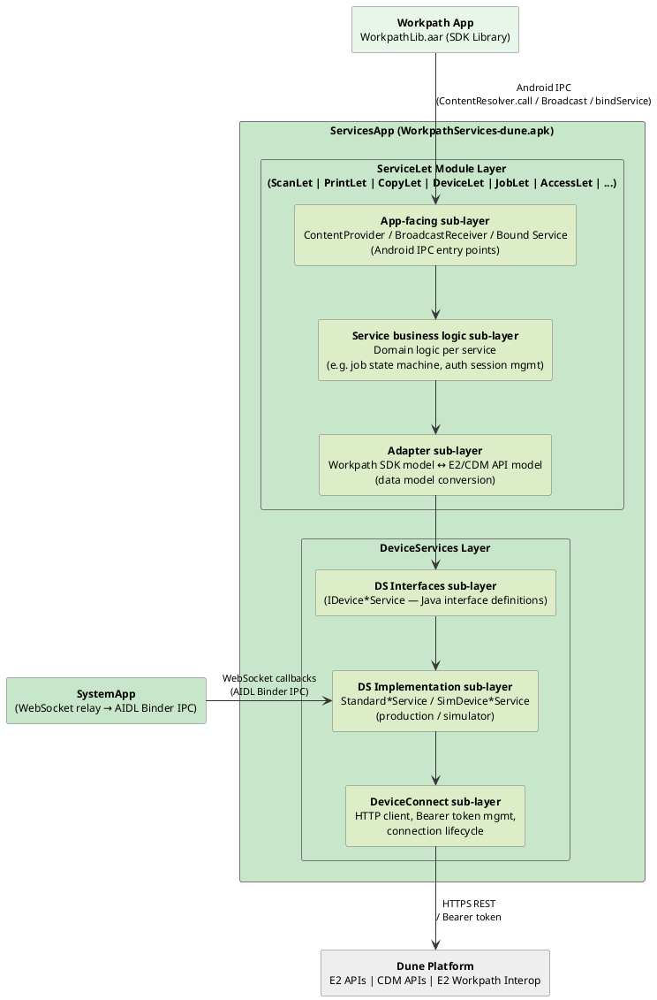
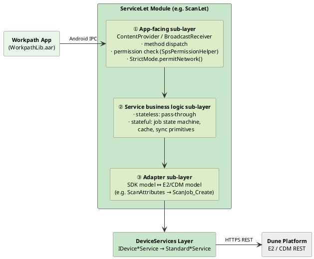
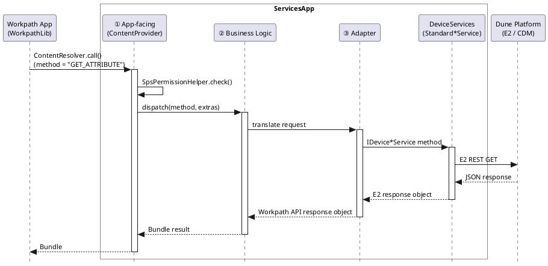
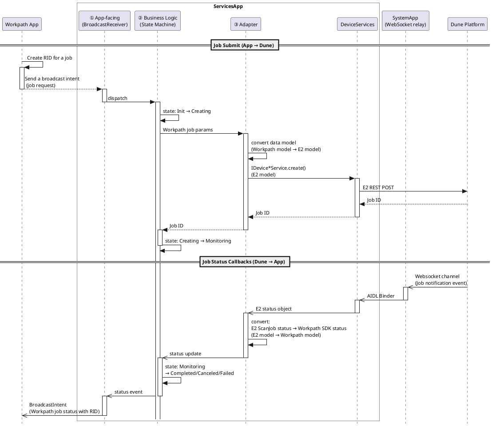
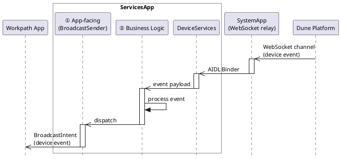
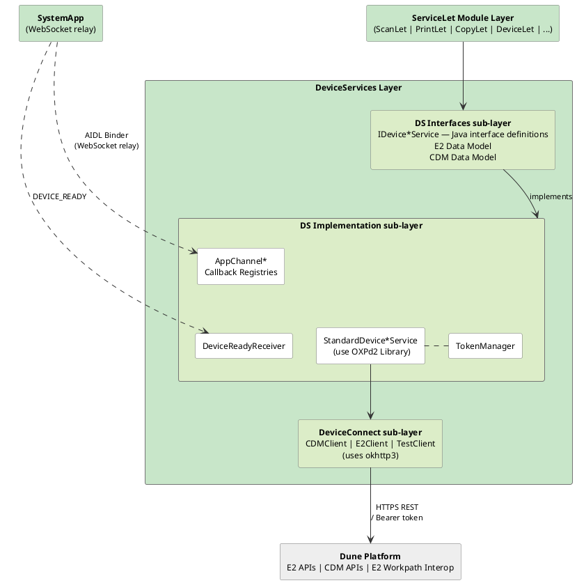

# Workpath ServicesApp

## 1. Overview

| Property | Value |
|---|---|
| **Repository** | `workpath-services-dune-master` |
| **Package** | `com.hp.jetadvantage.link.services` |
| **Version** | `1.6.2-s.60+D20260219` (versionCode 57) |
| **Build** | compileSdk 31, minSdk 29, targetSdk 29, Java 17, AGP 8.2.2 |
| **APK** | `WorkpathServices-dune.apk` |

**ServicesApp** is the Workpath API backend implementation of the Workpath Platform. It receives requests from `WorkpathLib.aar` via Android IPC (`ContentProvider`, `BroadcastReceiver`, Bound Service with AIDL Binder), then translates each SDK call into one or more HTTPS REST requests to the Dune E2 or CDM APIs on behalf of the calling app.

Internally, it follows a two-layer architecture:

- **ServiceLet Module Layer**: Composed of individual **Let modules** (`ScanLet`, `PrintLet`, `CopyLet`, `DeviceLet`, etc.), each implementing a specific device capability category. Each Let module is structured into three internal sub-layers:
  1. **App-facing sub-layer**: Handles IPC communication with the app using Android components such as `ContentProvider`, `BroadcastReceiver`, and bound `Service`.
  2. **Service business logic sub-layer**: Implements the domain logic specific to each service — for example, job-related services maintain an internal job state machine to track job lifecycle transitions.
  3. **Adapter sub-layer**: Translates between the Workpath SDK API data model and the device firmware API (E2/CDM) data model in both directions.

- **DeviceServices Layer**: Abstracts the Dune firmware interface. Manages solution access tokens per app and routes outbound HTTPS REST calls to the Dune E2, CDM, and E2 Workpath Interop APIs. Also receives asynchronous callbacks from the Dune platform via the E2 Workpath Interop WebSocket, relayed through SystemApp's AIDL Binder IPC.



> **See also**: [Architecture.md §1.2](../01_Concepts/Architecture.md#12-component-architecture) for the component architecture overview, and [PlatformServices.md §1.2](../01_Concepts/PlatformServices.md#12-servicesapp) for the ServicesApp internal layer diagram.

---

## 2. Project Structure

### 2.1 Build Variants

| Variant | Description |
|---|---|
| `debug` | Debug logs enabled build for hardware target, ProGuard disabled |
| `release` | Release build for hardware target, ProGuard enabled |
| `debugForSim` | Simulator variant, ProGuard disabled |
| `releaseForSim` | Simulator variant, ProGuard enabled |

### 2.2 Module Structure (32 Modules)

#### 2.2.1 Application Module

| Module | Directory |
|---|---|
| `:App-WorkpathServices` | `apps/workpathServices` |

#### 2.2.2 ServiceLet Modules (17)

| Module | Directory | Status |
|---|---|---|
| `:Let-ScanLet` | `Libs/ScanLet` | Active |
| `:Let-PrintLet` | `Libs/PrintLet` | Active |
| `:Let-CopyLet` | `Libs/CopyLet` | Active |
| `:Let-DeviceLet` | `Libs/DeviceLet` | Active |
| `:Let-JobLet` | `Libs/JobLet` | Active |
| `:Let-AccessLet` | `Libs/AccessLet` | Active |
| `:Let-AccessoryLet` | `Libs/AccessoryLet` | Active |
| `:Let-AttestationLet` | `Libs/AttestationLet` | Active |
| `:Let-ConfigLet` | `Libs/ConfigLet` | Active |
| `:Let-DeviceUsageLet` | `Libs/DeviceUsageLet` | Active |
| `:Let-DeviceEventsLet` | `Libs/DeviceEventsLet` | Active |
| `:Let-LauncherLet` | `Libs/LauncherLet` | Active |
| `:Let-StatisticsLet` | `Libs/StatisticsLet` | Active |
| `:Let-StorageLet` | `Libs/StorageLet` | Active |
| `:Let-SuppliesLet` | `Libs/SuppliesLet` | Active |
| `:Let-DeviceSettingsLet` | `Libs/DeviceSettingsLet` | Active |
| `:Let-EmailLet` | `Libs/EmailLet` | Active |

#### 2.2.3 DeviceServices Modules (4)

| Module | Directory | Description |
|---|---|---|
| `:DeviceServices-Interfaces` | `Libs/DeviceServices/Interfaces` | 28 interfaces |
| `:DeviceServices-Standard` | `Libs/DeviceServices/Standard` | 23+ production implementations |
| `:DeviceServices-Clients` | `Libs/DeviceServices/Clients` | HTTPS/CDM clients |
| `:DeviceServices-Sim` | `Libs/DeviceServices/Sim` | Mock implementations for simulator |

#### 2.2.4 Utility Libraries (4)

| Module | Directory | Description |
|---|---|---|
| `:Util-Common` | `Libs/Common` | Platform-wide common utilities (37 Java files) |
| `:Util-CommonServices` | `Libs/CommonServices` | Service infrastructure — Exceptions, Permissions, ContentProviders (28 Java files) |
| `:Util-Jabberwocky` | `Libs/jabberwocky` | Low-level HTTPS client + XML parsing (20 Java files) |
| `:Util-OXPd2` | `Libs/oxpd2` | OXPd v2 (E2/Dune) Resource/Facade REST client (~260 Java files) |

#### 2.2.5 API & UI Modules (3)

| Module | Directory |
|---|---|
| `:API-JetAdvantageLinkApi` | `Libs/JetAdvantageLinkApi` |
| `:UI-FileChooser` | `Libs/FileChooser` |
| `:UI-SettingsUiLib` | `Libs/SettingsUiLib` |

---

## 3. ServiceLet Module Architecture

Each Let module implements a specific device capability (scan, print, copy, device info, etc.) and is composed of three internal sub-layers. The following diagram shows how a request flows through these sub-layers, crosses into the DeviceServices Layer, and reaches the Dune firmware:



### 3.1 Sub-layer Responsibilities

| Sub-layer | Role | Key Classes |
|---|---|---|
| **① App-facing** | Receives SDK calls via Android IPC, dispatches by method name, verifies caller permissions | `*Provider`, `*Receiver` |
| **② Service business logic** | Implements domain logic. Stateless Lets (DeviceLet, SuppliesLet) simply forward requests; stateful Lets (ScanLet, CopyLet, JobLet) maintain job state machines, caches, or synchronization primitives | `*Service`, `*StateMachine`, `*util` |
| **③ Adapter** | Translates between Workpath SDK data models and Dune E2/CDM data models in both directions | `*Adapter`, `*Converter`, model mapping classes |

### 3.2 Common Patterns across All Let Modules

All Lets share the following patterns:
- Implementing an `IS_SUPPORTED` method to check feature availability
- Using `StrictMode.permitNetwork()` to allow E2 REST API calls on the ContentProvider thread
- Verifying caller permissions via `SpsPermissionHelper`
- Referencing the currently connected printer through `SelectedPrinterHelper`

### 3.3 Runtime Communication Patterns

#### 3.3.1 Pattern 1 — Synchronous Request–Response

For stateless device queries (capabilities, status, device info). The SDK call flows through all three sub-layers and returns synchronously.



**Used by**: DeviceLet (`GET_ATTRIBUTE`), SuppliesLet (`GET_SUPPLIES`), DeviceUsageLet (`GET_DEVICEUSAGE`), ConfigLet (`GET_CONFIG`/`SET_CONFIG`), StatisticsLet (`GET_JOBINFO`), and capability/status/defaults queries in ScanLet, PrintLet, CopyLet.

#### 3.3.2 Pattern 2 — Job Submit and Callback

For long-running device operations (scan, copy, print). The request follows Pattern 1 for job submission, then the Business Logic sub-layer manages an asynchronous job state machine driven by WebSocket callbacks.



**Used by**: ScanLet (scan jobs via E2 API), CopyLet (copy jobs via E2 API), PrintLet (print jobs via IPP).

#### 3.3.3 Pattern 3 — Device Event Push

Device-initiated events (USB accessory attached, paper jam, door open, supply low) arrive without an app request. The event enters through the DeviceServices Layer and flows upward through the Let module's sub-layers in reverse.



**Used by**: DeviceEventsLet (device state events delivered to subscribed apps), AccessoryLet (Accessory attached/detected).

---

## 4. ServiceLet Module Overview

ServicesApp contains 17 ServiceLet modules, each providing a specific device capability to SDK apps through ContentProvider-based IPC. The table below summarizes all Let modules by category. For detailed implementation patterns, ContentProvider authorities, and dispatch method specifications, see [Appendix A — ServiceLet Module Reference](#appendix-a--servicelet-module-reference).

| Let | Category | Files | DeviceServices Interface | Methods | Key Feature |
|---|---|---|---|---|---|
| ScanLet | Job | 28 | `IDeviceScanJobService` | 7 | Dual provider, file I/O |
| PrintLet | Job | 57 | `IDevicePrintJobService` | 7 | IPP protocol, 57 model classes |
| CopyLet | Job | 13 | `IDeviceCopyJobService` | 6 | CountDownLatch async delete |
| JobLet | Job | 27 | (own SQLite DB) | 4 | State machine, unified job mgmt |
| DeviceLet | Info/Status | 4 | `IDeviceInfoService` | 2 | query() + call() combined |
| DeviceEventsLet | Info/Status | 8 | `IDeviceEventService` | 3 | onCreate() callback registration |
| DeviceUsageLet | Info/Status | 3 | `IDeviceUsageService` | 2 | OXP only, minimal |
| SuppliesLet | Info/Status | 10 | `IDeviceSuppliesService` | 2 | SharedPrefs caching |
| StatisticsLet | Info/Status | 7 | `IDeviceStatisticsService` | 5 | Pagination, sequence commit |
| AccessLet | Auth/Security | 16 | `IDeviceAccessService` + `IDeviceAuthenticationService` | 7 | CompletableFuture, dual service |
| AttestationLet | Auth/Security | 14 | `IDeviceAttestationService` | 2 | HP Cloud token exchange |
| AccessoryLet | Peripheral/IO | 10 | `IDeviceAccessoryService` | 16 | HID lifecycle, most methods |
| StorageLet | Peripheral/IO | 9 | (`StorageFactory`/`IStorage`) | 15 | Filesystem abstraction |
| ConfigLet | Config/Settings | 4 | `IDeviceSolutionManager` | 3 | Rate limiting (10/5s) |
| DeviceSettingsLet | Config/Settings | 1 | (created inline) | 3 | Smallest, Panel only |
| LauncherLet | Panel-Specific | 2 | `IDeviceUISwitchService` | 5 | Custom methods, 300ms |
| EmailLet | Panel-Specific | 2 | (created inline) | 3 | Panel only, email attachment |

---

## 4. DeviceServices Layer

DeviceServices is the abstraction layer within ServicesApp that separates ServiceLet module logic from Dune firmware communication. It resides in `Libs/DeviceServices/`.

**Rationale:** If Let modules called the Dune firmware's E2/CDM REST APIs directly, every Let would need modification whenever the protocol changes. The DeviceServices layer separates interfaces from implementations: (1) Let modules reference only interfaces without knowing protocol details, (2) `Standard` implementations communicate with real Dune firmware, and (3) `Sim` implementations return mock data for the future virtual simulator without Dune/E2 simulator (currently `Sim` implementations are not used).



### 4.1 DS Interfaces Sub-layer

**Module**: `:DeviceServices-Interfaces` | **Directory**: `Libs/DeviceServices/Interfaces`

The Interfaces sub-layer defines the device abstraction contract. Let modules depend on these interfaces.

#### 4.1.1 Device Operation Interfaces (18)

Defines 18 `IDevice*Service` Java interfaces — one per device capability area. Each interface is consumed by the corresponding Let module and implemented by the `Standard*Service` class in the DS Implementation sub-layer.

| Interface | Consuming Let | Role |
|---|---|---|
| `IDeviceScanJobService` | ScanLet | Scanner status query, scan job creation/retrieval with default options and profiles, job deletion, cancellation, and notification callbacks |
| `IDevicePrintJobService` | PrintLet | IPP endpoint and UI context token provision for print operations |
| `IDeviceCopyJobService` | CopyLet | Copy job creation/retrieval with capabilities and profiles, job cancellation, and event notifications |
| `IDeviceInfoService` | DeviceLet | Device characteristics retrieval (deployment info, identity, print engine, scanner details, status, language) |
| `IDeviceAccessService` | AccessLet | Authentication principal resolution and authentication agent enumeration |
| `IDeviceAuthenticationService` | AccessLet | Session-based sign in/out workflows with pre/post-prompt and session change notifications |
| `IDeviceAccessoryService` | AccessoryLet | USB HID accessory lifecycle management (open/close for owned/shared accessories, async read operations, agent/solution registration status) |
| `IDeviceAttestationService` | AttestationLet | Device attestation info retrieval (boot mode, secure state, cloud stack) and cloud attestation token generation |
| `IDeviceSolutionManager` | ConfigLet | Per-solution configuration management (read/write/modify JSON config data and metadata) |
| `IDeviceUsageService` | DeviceUsageLet | Device lifetime counters retrieval (print/copy/scan usage statistics) |
| `IDeviceEventService` | DeviceEventsLet | Device event query and callback registration for event stream updates |
| `IDeviceSettingsService` | DeviceSettingsLet | Network print services query, enable/disable operations |
| `IDeviceEmailService` | EmailLet | SMTP/email service status and email configuration retrieval |
| `IDeviceUISwitchService` | LauncherLet | Panel UI screen switching and remote app launch/close from device home |
| `IDeviceStatisticsService` | StatisticsLet | Job statistics query with pagination/offset, sequence tracking, and completion notifications |
| `IDeviceStorageService` | StorageLet | Removable storage device enumeration with app install/uninstall and system state change callbacks |
| `IDeviceSuppliesService` | SuppliesLet | Device identity and supplies/toner/ink level query and status |
| `IDeviceManagementService` | (Infrastructure) | Device connection, Discovery Tree, token manager initialization |

#### 4.1.2 Data Model Packages

| Package | Description |
|---|---|
| `com.hp.ext.service.*` | E2 service data types (15 sub-domains: application, authentication, copy, device, deviceUsage, jobStatistics, printJob, scanJob, sdkSupport, security, solutionDiagnostics, solutionManager, supplies, usbAccessories, webhook) |
| `com.hp.ws.cdm.*` | CDM data types (alert, certificate, clock, controlpanel, diagnostic, email, ioConfig, jobmanagement, network, pubsub, security, storage, system, usbhost, etc.) |
| `com.hp.ws.e2workpathInterop.*` | E2 Interop types (AppToken, Credential, SmtpServer) |
| `com.hp.ws.websocket.*` | WebSocket message types (AppChannelMessage, CdmPubMessage, GatewayMessage, SystemManagementMessage, WorkpathGatewayData) |

### 4.2 DS Implementation Sub-layer

**Module**: `:DeviceServices-Standard` | **Directory**: `Libs/DeviceServices/Standard`

The Implementation sub-layer contains the production `StandardDevice*Service` classes that implement the Interfaces, plus common infrastructure for initialization, callback registries, app channel handling, and token management.

#### 4.2.1 StandardDevice*Service Implementations

Each `IDevice*Service` interface has a corresponding `Standard*Service` production implementation. All extend the `StandardDeviceService` base class and delegate to the OXPd2 Library for Resource/Facade-based REST client construction.

| Implementation | OXPd2 Client | Device Protocol |
|---|---|---|
| `StandardDeviceScanJobService` | `ScanJobServiceClient` | E2 REST |
| `StandardDevicePrintJobService` | `PrintJobServiceClient` + `IppClient` | E2 REST + IPP |
| `StandardDeviceCopyJobService` | `CopyServiceClient` | E2 REST |
| `StandardDeviceInfoService` | `DeviceServiceClient` | E2 REST |
| `StandardDeviceAccessService` | `SecurityServiceClient` | E2 REST |
| `StandardDeviceAuthenticationService` | `AuthenticationServiceClient` | E2 REST |
| `StandardDeviceAccessoryService` | `UsbAccessoriesServiceClient` | E2 REST |
| `StandardDeviceAttestationService` | — (`e2WorkpathInterop/v1/appAttestation`) | E2WorkpathInterop REST |
| `StandardDeviceSolutionManager` | `SolutionManagerServiceClient` | E2 REST |
| `StandardDeviceUsageService` | `DeviceUsageServiceClient` | E2 REST |
| `StandardDeviceEventService` | — (WebSocket callback) | WebSocket |
| `StandardDeviceSettingsService` | — (CDM path) | CDM REST |
| `StandardDeviceEmailService` | — (CDM SMTP settings) | CDM REST |
| `StandardDeviceUISwitchService` | — (`e2WorkpathInterop/v1/workpathGateway`) | E2WorkpathInterop REST |
| `StandardDeviceStatisticsService` | `JobStatisticsServiceClient` | E2 REST |
| `StandardDeviceSuppliesService` | `SuppliesServiceClient` | E2 REST |
| `StandardDeviceAppInitService` | `ApplicationServiceClient` | E2 REST |

**`StandardDeviceService` Base Class** — All `Standard*Service` classes extend this base, which provides:

| Method | Description |
|---|---|
| `getDeviceIPAddress()` | Returns configured device IP |
| `getDiscoveryTree()` | Returns `ServicesDiscoveryImpl` from Discovery Tree |
| `getSolutionToken(String packageName)` | Delegates to `AppTokenManager` |
| `getUiContextToken(String packageName)` | Delegates to `UIContextTokenManager` |
| `isDeviceConnected()` | Checks device connectivity |
| `perform()` | Wraps E2/CDM API calls with consistent exception handling |

#### 4.2.2 Bootup Initialization (DeviceReadyReceiver)

Receives the `DEVICE_READY` broadcast from SystemApp during platform initialization. Triggers `StandardDeviceManagementService.initialize(deviceIP, token)` which sets the device IP address, retrieves the Discovery Tree via `/cdm/servicesDiscovery/`, and initializes token managers.

**Management Singleton** — `StandardDeviceManagementService` holds device IP address, Discovery Tree, `AppTokenManager`, and `UIContextTokenManager`. Initialized with `setApplicationContext()` then `initialize(deviceIP, token)`.

**Discovery Tree** — `DiscoveryServiceClientImpl` queries `/cdm/servicesDiscovery/` and returns `ServicesDiscoveryResourceFacade` containing service GUNs and endpoint links. Used by `StandardDeviceManagementService` to resolve E2 service endpoints at initialization.

#### 4.2.3 AppChannel Management

AppChannel is the messaging bridge that routes WebSocket notifications from the Dune E2 service to registered callbacks via AIDL Binder IPC from SystemApp.

**Message Flow:**

```
Dune E2 Service (WebSocket)
        ↓
    SystemApp (AIDL Binder)
        ↓
AppChannelMessageHandler (IWebsocketCallback.onMessageReceived)
        ↓
    Message Router (5-stage pipeline)
    ├── Setup Stage    → AppChannelSetupMessageProcessor
    ├── Payload Stage  → AppChannelPayloadMessageProcessor
    ├── Service Stage  → AppChannelServiceMessageProcessor
    ├── Stream Stage   → AppChannelStreamMessageProcessor
    └── Teardown Stage → AppChannelTeardownMessageProcessor
        ↓
    AppChannelCallbackRegistry (lookup by E2ServiceGUN)
        ↓
    Standard*Service Callbacks
    (ISetupCallback, IPayloadCallback, IServiceCallback)
```

**Key Features:**

1. **Dynamic Callback Registration**: Messages queued if Standard*Service callback not yet registered; automatically delivered when callback arrives
2. **Sequential Service Execution**: Each channel has dedicated thread pool executor ensuring ordered RPC call execution
3. **Persistent Channel State**: AppChannelSetup (channel metadata) persisted for recovery across app lifecycle
4. **E2ServiceGUN Routing**: Messages routed by E2 service identifier, allowing multiple service types on same channel
5. **Multi-Stage Pipeline**: Supports complex notification sequences (SETUP → PAYLOAD → SERVICE → STREAM → TEARDOWN)

#### 4.2.4 Token Management

| Token Manager | Scope | TTL | Endpoint |
|---|---|---|---|
| `AppTokenManager` | Per-solution E2 token | 1 hr (refresh at 50 min) | `/cdm/e2WorkpathInterop/v1/appToken/{solutionId}` |
| `UIContextTokenManager` | Foreground-only token | Per screen session | Synchronized get/set/clear |

### 4.3 DeviceConnect Sub-layer

**Module**: `:DeviceServices-Clients` | **Directory**: `Libs/DeviceServices/Clients`

The DeviceConnect sub-layer provides the HTTPS client infrastructure used by StandardDevice*Service to communicate with the Dune firmware. It delegates to the **OXPd2 Library** (`Libs/oxpd2`) for Resource/Facade-based REST client construction, which in turn uses **okhttp3** (OkHttp 4.12.0) for the actual HTTPS transport.

| Client | Target | Usage |
|---|---|---|
| `E2Client` | E2 REST APIs | Used by most Standard*Services for E2 REST calls |
| `CDMClient` | CDM REST APIs | Used by DeviceSettingsLet, EmailLet, LauncherLet for CDM calls |
| `TestClient` | Test endpoints | Used for test/debug/UDW commands |

**Call Chain:** `Standard*Service` → `OXPd2 *ServiceClient` → `E2Client` / `CDMClient` → `okhttp3.OkHttpClient` → Dune Platform (HTTPS REST / Bearer token)

### 4.4 DeviceServices-Sim

**Module**: `:DeviceServices-Sim` | **Directory**: `Libs/DeviceServices/Sim`

Mock implementations for testing. Returns simulated data without firmware communication. Currently not used — reserved for the future virtual simulator without Dune/E2 simulator.

---

## 5. Utility Libraries

### 5.1 Util-Common — Platform-Wide Common Utilities

| Property | Value |
|---|---|
| **Source** | `Libs/Common` (37 Java files) |
| **Purpose** | Provides base utilities and model classes shared by all Lets and service modules |

| Class | Role |
|---|---|
| `Platform` | Runtime environment detection — `isPanel()`, `isMobile()`, `isEmulator()` |
| `Sdk` | SDK version constants, package name (`SERVICES_PACKAGE`), `VERSION_LEVEL` (ONE ~ SIX) |
| `PrinterInfo` | Device connection model, capabilities bitmask |
| `SelectedPrinterHelper` | ContentResolver-based access to current selected printer state |
| `SLog` | Logging wrapper |
| `JsonParser` | Gson wrapper |
| `ThreadPolicyManager` | AutoCloseable StrictMode manager — manages network permission via try-with-resources pattern |
| `FileSocketUtility` / `FileUtility` | File I/O utilities |
| `NetworkUtility` / `SecurityUtility` / `StringUtility` | Network/security/string utilities |
| `CommonConstants` / `ErrorMessages` / `LogConstants` | Shared constants |
| `PackageContract` | Package/solution configuration contract |
| `*JobCancelIntent` | Typed intents for Print/Scan/Copy job cancellation |

### 5.2 Util-CommonServices — Shared Service Infrastructure

| Property | Value |
|---|---|
| **Source** | `Libs/CommonServices` (28 Java files) |
| **Purpose** | Provides exception hierarchy, permission management, ContentProviders, and other service infrastructure shared by Let modules |

| Class | Role |
|---|---|
| `SdkException` family | `SdkConnectionErrorException`, `SdkInvalidParamException`, `SdkNotSupportedException`, `SdkServiceErrorException`, `SdkUnauthorizedException`, `SdkJobFailureException`, `SdkAuthenticationErrorException`, `SdkUnknownException` |
| `SpsPermissionHelper` / `SpsPermissionActivity` | Caller permission verification |
| `SelectedPrinterContentProvider` / `SelectedAccessContentProvider` / `SelectedAccessoryContentProvider` | Shared state ContentProviders |
| `ErrorCodeResolver` | Maps exceptions to Result error codes |
| `ServiceNotification` | Foreground service notification builder |
| `SpsCauseHelper` | JSON cause/error code builder |
| `BundleTypeAdapterFactory` / `UriJsonAdapter` | Gson adapters |

### 5.3 Util-Jabberwocky — Low-Level HTTPS & XML Library

| Property | Value |
|---|---|
| **Source** | `Libs/jabberwocky` (20 Java files) |
| **Purpose** | Provides low-level HTTPS client and XML serialization/deserialization needed for OXPd REST API communication |

| Class | Role |
|---|---|
| `HttpRequest` / `HttpResponse` | Raw HTTPS client |
| `RestXMLParser` / `RestXMLWriter` | XML serialization/deserialization for OXPd REST API |
| `RestXMLTagHandler` / `RestXMLTagStack` / `RestXMLNSHandler` | XML tag processing |
| `JSONConverter` | JSON conversion utility |
| `Chronicler` | Debug/logging utility |
| `PinningTrustManager` | Certificate pinning |
| `HttpHostnameVerifier` | Hostname verification |

### 5.4 Util-OXPd2 — E2 REST Client Library

| Property | Value |
|---|---|
| **Source** | `Libs/oxpd2` (~260 Java files) — **largest utility library** |
| **Purpose** | Provides Resource/Facade pattern-based REST clients for the OXPd v2 (E2/Dune) protocol. Used by Standard*Service when making actual E2 API calls |
| **Architecture Pattern** | `*Resource` + `*ResourceFacade` pairs |
| **Reference** | [oxpd2-libraries repository](https://github.azc.ext.hp.com/extensibility-2-0/oxpd2-libraries) |

| Service Client | Target API |
|---|---|
| `ScanJobServiceClient` | Scan job management |
| `PrintJobServiceClient` | Print job management |
| `CopyServiceClient` | Copy job management |
| `AuthenticationServiceClient` | Authentication |
| `DeviceServiceClient` | Device information |
| `DeviceUsageServiceClient` | Usage data |
| `JobStatisticsServiceClient` | Statistics |
| `SecurityServiceClient` | Security |
| `SuppliesServiceClient` | Supplies |
| `UsbAccessoriesServiceClient` | USB accessories |
| `SolutionManagerServiceClient` | Solution configuration |
| `OAUTH2ServiceClient` | OAuth2 tokens |

**Base Infrastructure:** `HttpClient` base, `CustomObjectMapper`, multipart support

---
---

## Appendix A — ServiceLet Module Reference

This appendix provides detailed specifications for each of the 17 ServiceLet modules, including ContentProvider authorities, dispatch methods, DeviceServices bindings, and key implementation patterns.

### A.1 Job-Related Lets

#### A.1.1 ScanLet — Scan Functionality

| Property | Value |
|---|---|
| **Source** | `Libs/ScanLet` (28 Java files) |
| **ContentProvider** | `ScanletContentProvider` |
| **Authority** | `com.hp.jetadvantage.link.authority.scanletcp` |
| **DeviceServices** | `IDeviceScanJobService` → `StandardDeviceScanJobService` |
| **Dispatch Methods** | `IS_SUPPORTED`, `GET_CAPS`, `GET_DEFAULTS`, `GET_FILE_OPTIONS_CAPS`, `GET_STATUS`, `GET_FILE_REQ`, `PUT_FILE_REQ` |

**Role:** Enables SDK apps to control the MFP scanner for document scanning. Provides scan capabilities/defaults query, scan job initiation, and scan file retrieval.

**Key Implementation Patterns:**
- **Dual ContentProvider**: Split into `ScanletContentProvider` (control) and `ScanFileContentProvider` (file transfer)
- **Transmission Mode**: Extracts `JOB` (default) mode from extras to determine transfer method
- **File Management**: Stores scanned files in temp folders, integrated with `JobDataContentProvider` for tracking
- **URI Permission**: Revokes URI permissions via `revokeUriPermission()` after scan completion

#### A.1.2 PrintLet — Print Functionality

| Property | Value |
|---|---|
| **Source** | `Libs/PrintLet` (57 Java files) — **largest Let** |
| **ContentProvider** | `OXPPrintletContentProvider` (1,415 lines) |
| **Authority** | `com.hp.jetadvantage.link.authority.printletcp` |
| **DeviceServices** | `IDevicePrintJobService` → `StandardDevicePrintJobService`; IPP path uses `IppClient` |
| **Dispatch Methods** | `IS_SUPPORTED`, `IS_STATUS_SUPPORTED`, `GET_JOB_COUNT`, `GET_AVAILABLE_JOB_COUNT`, `GET_CAPS`, `GET_DEFAULTS`, `GET_STATUS`, `GET_TRAY_INFO` |

**Role:** Enables SDK apps to print documents on the MFP. Provides print capabilities/defaults query, tray info query, and job count/availability checks.

**Key Implementation Patterns:**
- **IPP (Internet Printing Protocol)**: Supports IPP via `IppClient`, `IppConnector`, `IppConstants`, including IPP status constants (e.g., `IPP_PRINTER_BUSY = 0x0507`)
- **Print Spooler**: Tracks print spooler/job count via `OXPCreatePrintSpoolerIntentService`
- **Model Mapping**: 57 Java files with rich model mapping classes including `CollateMode`, `ColorMode`, `FileType`, `Finishings`, `MediaSize`, `MediaSource`, `MediaType`, `Orientation`, `OutputBin`, `PlexMode`, `PrintQuality`, `ScalingMode`, `StapleMode`, etc.
- **Mobile Restriction**: Blocks mobile clients below `VERSION_LEVEL.THREE`
- **StorageLet Dependency**: Uses `StorageFactory` to access file storage

#### A.1.3 CopyLet — Copy Functionality

| Property | Value |
|---|---|
| **Source** | `Libs/CopyLet` (13 Java files) |
| **ContentProvider** | `OXPCopyletContentProvider` |
| **Authority** | `com.hp.jetadvantage.link.authority.copyletcp` |
| **DeviceServices** | `IDeviceCopyJobService` → `StandardDeviceCopyJobService` |
| **Dispatch Methods** | `IS_SUPPORTED`, `GET_CAPS`, `GET_DEFAULTS`, `GET_STATUS`, `DELETE_JOB`, `ENUMERATE_JOBS` |

**Role:** Enables SDK apps to control the MFP copy function. Provides copy capabilities/defaults query and copy job deletion.

**Key Implementation Patterns:**
- **Async Delete**: `deleteJob()` uses `CountDownLatch` with 60-second timeout, receives results via `ResultReceiver`
- **CopyJobIntentService**: Handles job deletion in a separate IntentService
- **ClassLoader Setup**: Explicitly sets ClassLoader for `DeleteRequestIntent`/`JobCredentialsAttributes` deserialization
- **Not Implemented**: `ENUMERATE_JOBS` throws `SdkNotSupportedException` (TODO: DUNE-169955)

#### A.1.4 JobLet — Unified Job State Management

| Property | Value |
|---|---|
| **Source** | `Libs/JobLet` (27 Java files) |
| **ContentProvider** | `JobletContentProvider` (492 lines) + `JobDataContentProvider` |
| **Authority** | `com.hp.jetadvantage.link.authority.joblet` |
| **DeviceServices** | None — uses its own SQLite DB |
| **Dispatch Methods** | `CANCEL_JOB`, `GET_JOB_INFO`, `GET_PROCESSING_INFO`, `GET_JOB_RID` |

**Role:** Centrally tracks the state of print/scan/copy jobs and provides job cancellation. Manages jobs created by other Lets (ScanLet, PrintLet, CopyLet) in a unified manner.

**Key Implementation Patterns:**
- **State Machine**: Provides `BaseJobIntentServiceStateMachine` framework `Init → Creating → Monitoring → Completed/Canceled/Failed → End` lifecycle
- **SQLite DB**: Stores client registration and job state in `joblet_db` database
- **Dual ContentProvider**: `JobletContentProvider` (control) and `JobDataContentProvider` (in-memory/SQLite job store)
- **Cancel Intent Routing**: Creates typed cancel intents per job type — `PrintJobCancelIntent`, `ScanJobCancelIntent`, `CopyJobCancelIntent`
- **LocalBroadcastManager**: Uses LocalBroadcast for event dispatch
- **State Check**: Checks `JobState` before cancellation (`TL_ST_CANCELED`, `TL_ST_COMPLETE`, `TL_ST_FAILED` — already finished)
- **Note**: `GET_PROCESSING_INFO` always returns `NOT_SUPPORTED`

### A.2 Device Information & Status Lets

#### A.2.1 DeviceLet — Device Attribute Query

| Property | Value |
|---|---|
| **Source** | `Libs/DeviceLet` (4 Java files) |
| **ContentProvider** | `DeviceletContentProvider` |
| **Authority** | `com.hp.jetadvantage.link.authority.deviceletcp` |
| **DeviceServices** | `IDeviceInfoService` → `StandardDeviceInfoService` |
| **Dispatch Methods** | `IS_SUPPORTED`, `GET_ATTRIBUTE` |

**Role:** Allows SDK apps to query device attributes (model name, serial number, feature list, etc.) of the currently connected MFP.

**Key Implementation Patterns:**
- **`query()` Implementation**: Implements `query()` in addition to `call()`, supporting `MatrixCursor`-based cursor queries
- **ApiType Restriction**: Only `ApiType.OXP` is allowed
- **Version Restriction**: `GET_ATTRIBUTE` requires `clientVersion >= 3`
- **ThreadPolicyManager**: Manages StrictMode via try-with-resources pattern

#### A.2.2 DeviceEventsLet — Device Event Delivery

| Property | Value |
|---|---|
| **Source** | `Libs/DeviceEventsLet` (8 Java files) |
| **ContentProvider** | `DeviceEventsLetContentProvider` |
| **Authority** | `com.hp.jetadvantage.link.authority.deviceeventsletcp` |
| **DeviceServices** | `IDeviceEventService` → `StandardDeviceEventService` |
| **Dispatch Methods** | `IS_SUPPORTED`, `INIT_DEVICE_EVENTS` (`"init_device_events"`), `GET_DEVICE_EVENTS` |

**Role:** Delivers device events (paper out, jam, door open, etc.) from the MFP to SDK apps.

**Key Implementation Patterns:**
- **Callback Registration**: Calls `DeviceEventAdapter.addCallback(mDeviceEventService, new DeviceEventHandler(getContext()))` at `onCreate()` time
- **Shared Handler**: `INIT_DEVICE_EVENTS` and `GET_DEVICE_EVENTS` share the same handler
- **StandardJsonParser**: Uses `StandardJsonParser.INSTANCE` (provided by DeviceServices) for JSON parsing

#### A.2.3 DeviceUsageLet — Device Usage Query

| Property | Value |
|---|---|
| **Source** | `Libs/DeviceUsageLet` (3 Java files) |
| **ContentProvider** | `DeviceUsageLetContentProvider` |
| **Authority** | `com.hp.jetadvantage.link.authority.deviceusageletcp` |
| **DeviceServices** | `IDeviceUsageService` → `StandardDeviceUsageService` |
| **Dispatch Methods** | `IS_SUPPORTED`, `GET_DEVICEUSAGE` |

**Role:** Allows querying the MFP's usage data (total print/copy/scan counts, etc.).

**Key Implementation Patterns:**
- **OXP Only**: Only supports `ApiType.OXP`
- **Minimal Implementation**: One of the simplest Lets with only 3 files
- **Nested try-catch**: Graceful fallback on Dune API call failure

#### A.2.4 SuppliesLet — Supplies Information Query

| Property | Value |
|---|---|
| **Source** | `Libs/SuppliesLet` (10 Java files) |
| **ContentProvider** | `SuppliesLetContentProvider` |
| **Authority** | `com.hp.jetadvantage.link.authority.suppliesletcp` |
| **DeviceServices** | `IDeviceSuppliesService` → `StandardDeviceSuppliesService` |
| **Dispatch Methods** | `IS_SUPPORTED`, `GET_SUPPLIES` |

**Role:** Allows querying the MFP's supply status (toner/ink levels, paper levels, etc.).

**Key Implementation Patterns:**
- **SharedPreferences Caching**: Caches make & model info in `SharedPreferences`
- **SuppliesData**: Wrapper class combining `SuppliesInfo` + make/model
- **Identity Fallback**: Falls back to Identity lookup when model info retrieval fails

#### A.2.5 StatisticsLet — Job Statistics Query

| Property | Value |
|---|---|
| **Source** | `Libs/StatisticsLet` (7 Java files) |
| **ContentProvider** | `StatisticsLetContentProvider` |
| **Authority** | `com.hp.jetadvantage.link.authority.statisticsletcp` |
| **DeviceServices** | `IDeviceStatisticsService` → `StandardDeviceStatisticsService` |
| **Dispatch Methods** | `IS_SUPPORTED`, `GET_JOBINFO`, `GET_LASTJOBSEQUENCE`, `COMMIT_LASTJOBSEQUENCE`, `GET_LASTCOMMITTEDJOBSEQUENCE` |

**Role:** Queries MFP job statistics (print/copy/scan history) with pagination and manages the last-queried position (job sequence) via commit/retrieve.

**Key Implementation Patterns:**
- **Pagination**: Supports pagination via `limit` (default 256) and `offset` (default 0) parameters
- **Job Sequence Management**: Cursor-based consumption pattern `GET_LASTJOBSEQUENCE` → `COMMIT_LASTJOBSEQUENCE` → `GET_LASTCOMMITTEDJOBSEQUENCE`
- **Package Authorization**: Caller package verification

### A.3 Authentication & Security Lets

#### A.3.1 AccessLet — Authentication and Session Management

| Property | Value |
|---|---|
| **Source** | `Libs/AccessLet` (16 Java files) |
| **ContentProvider** | `AccessletContentProvider` (446 lines) |
| **Authority** | `com.hp.jetadvantage.link.authority.accessletcp` |
| **DeviceServices** | `IDeviceAccessService` + `IDeviceAuthenticationService` (dual) → `StandardDeviceAccessService`, `StandardDeviceAuthenticationService` |
| **Dispatch Methods** | `getCachedAuthData`, `IS_SUPPORTED`, `GET_PROPERTIES`, `SIGN_IN`, `SIGN_OUT`, `START_SIGN_IN_PROCESS`, `GET_TOKEN` |

**Role:** Handles user authentication (LDAP, PIN, Windows, etc.) on the MFP and manages authentication sessions. Supports both pre-prompt and post-prompt authentication flows.

**Key Implementation Patterns:**
- **AuthSyncManager**: Pre-prompt sign-in synchronization using `CompletableFuture<Bundle>`. Manages response futures via `ConcurrentHashMap<String, CompletableFuture<Bundle>>`
- **Dual DeviceServices**: Uses both Access and Authentication DeviceServices interfaces simultaneously
- **Session Management**: Tracks Dune sessions via `mSessionHash`/`mCredentialHash`
- **SharedPreferences Caching**: Caches authentication data in `AuthCachePrefs`
- **getCachedAuthData**: Special method processed before printer connection check
- **Home Screen Return**: Calls `backToHomeScreen()` after sign-in completion

#### A.3.2 AttestationLet — Cloud Attestation Token

| Property | Value |
|---|---|
| **Source** | `Libs/AttestationLet` (14 Java files) |
| **ContentProvider** | `AttestationletContentProvider` (604 lines) |
| **Authority** | `com.hp.jetadvantage.link.authority.attestationletcp` |
| **DeviceServices** | `IDeviceAttestationService` → `StandardDeviceAttestationService` (emulator: loads `SimDeviceAttestationService` via reflection) |
| **Dispatch Methods** | `IS_SUPPORTED`, `GET_TOKEN` |

**Role:** Communicates with HP Cloud (`core.api.hp.com`) to issue device attestation tokens. Provides the authentication credentials apps need to access HP cloud services.

**Key Implementation Patterns:**
- **OkHttp HTTPS Client**: Distinguishes between `core.api.hp.com` (production) and `stage.api.hp.com` (staging)
- **Execution Mode**: Switches endpoints based on Development/Production mode
- **AppPlatformConfiguration**: Configuration parsing
- **Package Config**: Package configuration utility for solution ID lookup
- **Emulator Support**: Creates Sim service via reflection

### A.4 Peripheral & I/O Lets

#### A.4.1 AccessoryLet — USB HID Accessory Management

| Property | Value |
|---|---|
| **Source** | `Libs/AccessoryLet` (10 Java files) |
| **ContentProvider** | `AccessoryLetContentProvider` (617 lines) |
| **Authority** | `com.hp.jetadvantage.link.authority.accessoryletcp` |
| **DeviceServices** | `IDeviceAccessoryService` → `StandardDeviceAccessoryService` |
| **Dispatch Methods** | `IS_SUPPORTED`, `IS_READY`, `REGISTER`, `ENUMERATE`, `GET_SHARED`, `GET_OWNED`, `RESEND_OWNED`, `RESERVE`, `RELEASE`, `OPEN`, `CLOSE`, `START_READING`, `STOP_READING`, `GET_HID_INFO`, `READ_REPORT`, `WRITE_REPORT` (16 total — **most dispatch methods**) |

**Role:** Manages the full lifecycle of USB HID accessories (barcode readers, card readers, etc.) connected to the MFP.

**Key Implementation Patterns:**
- **HID Lifecycle**: `register → enumerate → reserve → open → read/write → close → release` sequence
- **Shared vs Owned**: Distinguishes between shared and exclusively-owned accessories
- **AccessoryRegistrationRecord**: Persistent registration management
- **AccessoryCache**: Runtime accessory state caching
- **Notification**: Sends notifications to apps via `AccessoryNotificationService.sendAccessoryNotificationToApp()`
- **AccessoryProvider**: Functional interface for filtered accessory retrieval
- **Backward Compatibility**: Default report ID of 0 for backward compatibility

#### A.4.2 StorageLet — File Storage Access

| Property | Value |
|---|---|
| **Source** | `Libs/StorageLet` (9 Java files) |
| **ContentProvider** | `StorageLetContentProvider` (915 lines) |
| **Authority** | `com.hp.jetadvantage.link.authority.storageletcp` |
| **DeviceServices** | None — uses its own `StorageFactory`, `IStorage`, `HDDStorage`, `USBStorage` |
| **Dispatch Methods** | `IS_SUPPORTED`, `GET_STORAGE_LIST`, `GET_STORAGE`, `CREATE_NEW_FILE`, `CREATE_NEW_DIRECTORY`, `DELETE_FILE`, `LIST_FILES`, `IS_FILE`, `IS_DIRECTORY`, `FILE_EXISTS`, `FILE_LAST_MODIFIED`, `FILE_LENGTH`, `FILE_RENAME`, `GET_FILE_URI`, `GET_FILE_SOCKET` (15 total — **second-most dispatch methods**) |

**Role:** Enables file system operations (create, delete, list, rename, etc.) on the MFP's HDD (internal storage) and USB (external storage).

**Key Implementation Patterns:**
- **Dual Storage**: `HDDStorage` and `USBStorage` — both implement `IStorage` interface, created via `StorageFactory`
- **PathStrategy**: Custom `PathStrategy` (`SimplePathStrategy`) similar to `FileProvider` for HDD/USB root path mapping
- **openFile()**: Overrides `openFile()` for `ParcelFileDescriptor` support
- **Socket-based Transfer**: Socket-based file transfer via `FileSocketUtility`
- **Version Restriction**: Clients below v6 can only use USB
- **Model Restriction**: Model-specific checks for `nanotesla`, `tron`, etc.

### A.5 Configuration & Settings Lets

#### A.5.1 ConfigLet — Solution Configuration Management

| Property | Value |
|---|---|
| **Source** | `Libs/ConfigLet` (4 Java files) |
| **ContentProvider** | `ConfigLetContentProvider` |
| **Authority** | `com.hp.jetadvantage.link.authority.configletcp` |
| **DeviceServices** | `IDeviceSolutionManager` → `StandardDeviceSolutionManager` |
| **Dispatch Methods** | `IS_SUPPORTED`, `GET_CONFIG`, `SET_CONFIG` |

**Role:** Allows SDK apps to read and write per-solution configuration data stored on the MFP. Used for persisting app settings such as server URLs and behavior options on the device.

**Key Implementation Patterns:**
- **Rate Limiting**: Tracks per-package modification timestamps via `ConcurrentHashMap<String, ConcurrentLinkedDeque<LocalDateTime>>`. `isModifiedFrequently()` prevents excessive notifications when ≥ 10 modifications occur within 5 seconds
- **Size Limit**: Config data is limited to 66,560 bytes maximum
- **Caller Verification**: Package name validation for anti-spoofing

#### A.5.2 DeviceSettingsLet — Print Enable/Disable

| Property | Value |
|---|---|
| **Source** | `Libs/DeviceSettingsLet` (1 Java file) — **smallest Let** |
| **ContentProvider** | `DeviceSettingsLetContentProvider` |
| **Authority** | `com.hp.jetadvantage.link.authority.devicesettingstcp` |
| **DeviceServices** | `StandardDeviceSettingsService` (created inline, no interface) |
| **Dispatch Methods** | `IS_SUPPORTED`, `ENABLE_PRINMTING`, `DISABLE_PRINMTING` |

**Role:** Enables or disables printing functionality on the Panel.

**Key Implementation Patterns:**
- **Panel Only**: Checks `Platform.isPanel()`
- **Inline Service**: Creates `StandardDeviceSettingsService` directly within methods without interface-based DI
- **Constant Typo**: `"PRINMTING"` (typo for PRINTING) — exists as-is in the code
- **Note**: Not included in `settings.gradle` build dependencies (compiled but may not be included in the app)

### A.6 Panel-Specific Lets

#### A.6.1 LauncherLet — UI Screen Switching

| Property | Value |
|---|---|
| **Source** | `Libs/LauncherLet` (2 Java files) |
| **ContentProvider** | `LauncherLetContentProvider` |
| **Authority** | `com.hp.jetadvantage.link.authority.launcherletcp` |
| **DeviceServices** | `IDeviceUISwitchService` → `StandardDeviceUISwitchService` (created inline) |
| **Dispatch Methods** | `IS_SUPPORTED`, `LAUNCH` (sub-dispatch: `LaunchAction.HOME`), `APPLICATION`, `launchFromDeviceHome` (custom), `exitFromDeviceHome` (custom) |

**Role:** Controls Panel home screen switching and app launching from SDK apps.

**Key Implementation Patterns:**
- **Custom Methods**: `launchFromDeviceHome`, `exitFromDeviceHome` — internal custom methods not exposed in the public SDK API
- **Version-specific Restrictions**: `LAUNCH` requires v2+, `APPLICATION` requires v3+
- **LauncherUtility**: Retrieves intent URI via `getButtonInfo()`
- **300ms Delay**: 300ms sleep before navigating to home screen
- **Panel Only**: Supported only on Panel

#### A.6.2 EmailLet — Email Sending

| Property | Value |
|---|---|
| **Source** | `Libs/EmailLet` (2 Java files) |
| **ContentProvider** | `EmailContentProvider` |
| **Authority** | `com.hp.jetadvantage.link.authority.emailletcp` |
| **DeviceServices** | `StandardDeviceEmailService` (created inline) |
| **Dispatch Methods** | `IS_SUPPORTED`, `SEND`, `GET_DEFAULTS` |

**Role:** Controls the MFP's email sending function (scan-to-email) on the Panel.

**Key Implementation Patterns:**
- **Panel Only**: Supported only on Panel
- **File Attachment**: Handles attachments via `ParcelFileDescriptor` and temp folders
- **SMTP Settings**: Retrieves SMTP settings from `StandardDeviceEmailService`
- **Note**: Not included in `settings.gradle` build dependencies
