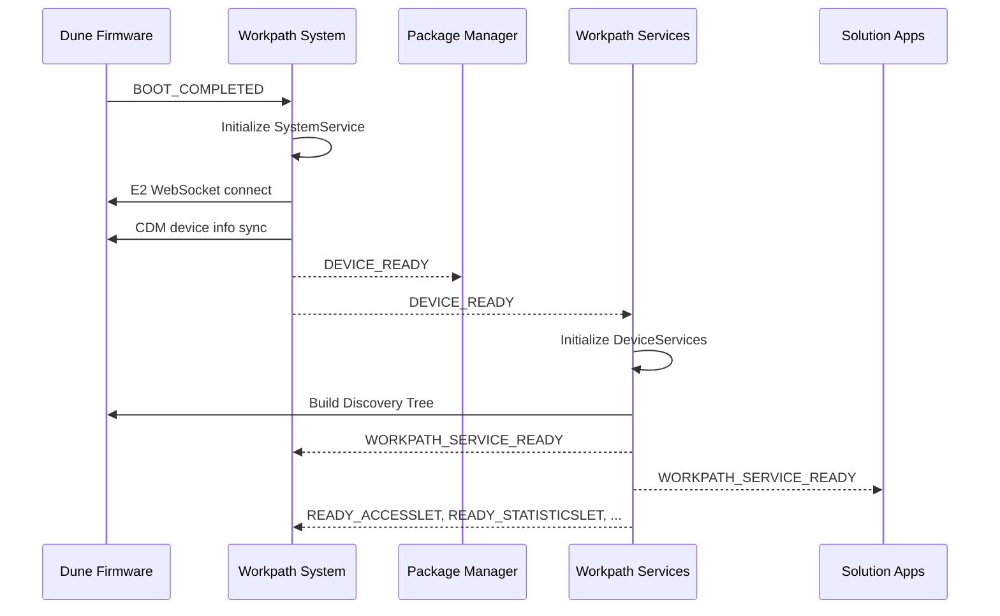

# Workpath Platform Lifecycle & Boot Sequence — Dune Platform

## 1. Boot Sequence

Based on manifest-declared receivers, services, and broadcast actions across all platform components:

### Phase 1: System Initialization

`BOOT_COMPLETED` → Workpath System's `BootCompletedReceiver`
- SystemService starts
- Database initialization (`SystemDBHelper`)
- Launcher configuration (`HomeScreenModel`, `AppLauncher`)

### Phase 2: Firmware Connection

SystemService → WebSocket + CDM connection
- E2 WebSocket connection via `Transport` / `E2WebSocektListener`
- Device identity, time, locale synchronization via CDM APIs
- WebSocket callback services activated (`WSCallbackSystemManagement`, `WSCallbackCdmPubMsg`, `WSCallbackGateway`, `WSCallbackStatusCheck`)

### Phase 3: Platform Ready

- **`DEVICE_READY`** broadcast sent → received by:
  - Package Manager's `DeviceReadyReceiver` (protected by `SYSTEM_PERMISSION`)
  - Workpath Services begins initialization

- **`WORKPATH_SERVICE_READY`** broadcast sent → received by:
  - Workpath System's `TestReceiver`
  - Solution apps can now initialize SDK via `Workpath.getInstance().initialize(context)`

### Phase 4: Services Initialization

`JetAdvantageLinkServicesApplication.onCreate()` → 
- `StandardDeviceManagementService.setApplicationContext()`
- Device IP and Discovery Tree initialization
- `StandardDeviceInitService` started (manifest-declared service)

### Phase 5: Let Readiness

Individual Lets report readiness:
- `READY_ACCESSLET`, `READY_STATISTICSLET`, `READY_STORAGELET`, `READY_DEVICEEVENTLET`, `READY_ACCESSORYLET`
- Received by Workpath System's `WorkpathReadyBroadcastReceiver`

### Boot Broadcast Sequence



## 2. Screen Switching (Context Switch)

Screen switching between Android (Workpath) and Modern UI (native printer UI) is managed by:
- **`SwitchReceiver`** in Workpath System — receives `com.hp.jetadvantage.link.SWITCH` broadcast (protected by `SWITCH_RECEIVER` permission)
- **E2 Workpath Interop API** — gateway management with `showDisplay`/`closeDisplay` actions via `WorkpathGatewayData`

### Impact on Tokens
- `UIContextTokenManager.clearUIConTextToken()` is called during context switches
- The UIContextToken is only valid for the currently active (foreground) solution
- SolutionToken (`AppTokenManager`) is not affected by context switches

## 3. Device Mode Events

`ModeReceiver` in Workpath System handles device mode changes:
- `EDX_CHANGED` — EDX mode change
- `AWAKE_CHANGED` — Wake/sleep state change
- `DEV_TEST` — Developer test mode

## 4. User Activity & Session

`TouchEventReceiver` receives `USER_ACTIVITY` broadcasts to track user interaction for session timeout management.

## 5. Service Readiness Events

Workpath Services sends individual Let readiness broadcasts:

| Broadcast | Let |
|---|---|
| `READY_ACCESSLET` | AccessLet |
| `READY_STATISTICSLET` | StatisticsLet |
| `READY_STORAGELET` | StorageLet |
| `READY_DEVICEEVENTLET` | DeviceEventsLet |
| `READY_ACCESSORYLET` | AccessoryLet |

These are received by `WorkpathReadyBroadcastReceiver` in Workpath System.

## 6. App Lifecycle Integration

### Solution App Initialization
```java
// Solution app must wait for WORKPATH_SERVICE_READY before calling:
Workpath.getInstance().initialize(context);
```

### Permission Requirement
All solution apps must declare:
```xml
<uses-permission android:name="com.hp.jetadvantage.link.permission.SERVICES_PERMISSION" />
```

Additional feature-specific permissions as needed (see [Permissions Reference](../04_References/Permissions.md)).
