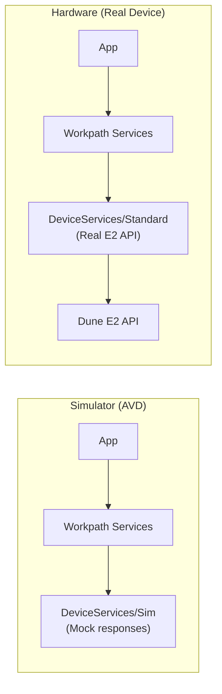
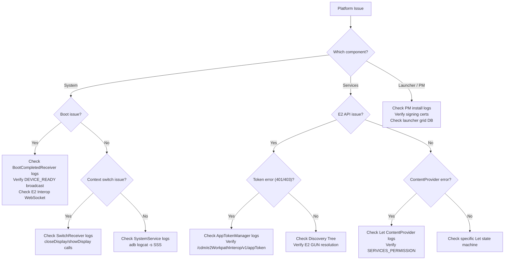

# Debugging & Troubleshooting — Dune Platform

## 1. Logging Strategy

Since direct ADB access is often restricted on production printers, **logging is the primary debugging tool** for platform developers.

### Platform Component Log Tags
Each Workpath component uses distinct log tag prefixes:

| Component | Tag Pattern | Examples |
|---|---|---|
| Workpath System | `[SSS]` | `[SSS][SystemService]`, `[SSS][BCRcv]`, `[SSS][Transport]`, `[SSS][SwitchRcv]` |
| Workpath Services (Let layer) | `{LetName}/` | `Scanlet/CP`, `Printlet/OXPPrintletCP`, `Scanlet/OPAdap` |
| Workpath Services (common) | `[WS]` | `[WS]SCAN`, `[WS]PRIN`, `[WS]JOB`, `[WS]AUTH` |
| DeviceServices Standard | `[WS]DSS/` | `[WS]DSS/DeviceMgmt`, `[WS]DSS/ScanJob`, `[WS]DSS/PrintJob` |
| DeviceServices Token | `[WS]DSS/` | `[WS]DSS/AppT` (AppTokenManager), `[WS]DSS` (UIContextTokenManager) |
| Package Manager | `[PM]` | `[PM][Install]`, `[PM][Verify]`, `[PM]CallbackService` |
| Link Launcher | `[Launcher]` | `[Launcher][Grid]`, `[Launcher][Home]` |

### Filtering in ADB
```bash
# View only Workpath System logs
adb logcat | grep SSS

# View Workpath Services Let layer logs (example: ScanLet)
adb logcat | grep "Scanlet"

# View DeviceServices / E2 client logs
adb logcat | grep "\[WS\]DSS"

# View token management (AppTokenManager / UIContextTokenManager)
adb logcat | grep "\[WS\]DSS/AppT\|\[WS\]DSS.*getUIContextToken"

# View all platform components together
adb logcat | grep -E "\[SSS\]|\[WS\]|Scanlet|Printlet|\[PM\]|\[Launcher\]"

# View E2 WebSocket transport
adb logcat | grep "\[SSS\]\[E2WebSocektListener\]"

# View context switching events
adb logcat | grep -E "\[SSS\]\[SwitchRcv\]|closeDisplay|showDisplay"
```

## 2. Retrieving Logs

### Via EWS (Embedded Web Server)
1. Open printer's IP address in a web browser
2. Navigate to **Tools** → **Troubleshooting** → **Advanced** → **Retrieve Diagnostic Data** and select "Create zipped debug information file" with "Generate Debug Data" to initiate diagnostics package generation

### Via USB
1. Insert FAT32 USB drive into printer
2. Navigate to Service Menu → Export Logs

### Via ADB (Development Mode)
```bash
# Live log stream
adb logcat

# Save to file
adb logcat > device_log.txt

# Clear and capture
adb logcat -c && adb logcat > fresh_log.txt
```

## 3. Using the Simulator

The **Workpath SDK Simulator** runs on your PC as an AVD (Android Virtual Device) and emulates the printer environment.

### Setup
1. Use `debugForSim` or `debug_sim` build variants
2. Install APKs to the AVD:
   ```bash
   adb install -r WorkpathServices-dune.apk
   adb install -r System-dune.apk
   ```
3. Trigger device ready:
   ```bash
   adb shell am broadcast \
     -a com.hp.workpath.intent.action.CALL_DEVICE_READY \
     -n com.hp.jetadvantage.link.system/.receivers.CDMCallReceiver
   ```

### Simulator vs. Hardware



| Aspect | Simulator | Hardware |
|---|---|---|
| **DeviceServices** | Sim (mock) | Standard (real) |
| **E2 API** | Mock responses | Real firmware |
| **ADB** | May be restricted | May be restricted |
| **Scanner** | Simulated | Real hardware |
| **Paper Jam** | Cannot test | Testable |
| **Speed** | Faster (no HW) | Real-world timing |

### Best Practice
Develop UI and logic on the Simulator → Test hardware integration on a real device.

## 4. Common Issues & Solutions

### "Service Not Found" / "ContentProvider Error"
```
Symptom: SsdkUnsupportedException during SDK initialization
```
- **Cause**: WorkpathServices APK not installed or not yet initialized.
- **Fix**: 
  1. Verify `WorkpathServices-dune.apk` is installed: `adb shell pm list packages | grep jetadvantage`
  2. Check that `WORKPATH_SERVICE_READY` broadcast has been sent. Inspect `[SSS]` logs for broadcast timing.
  3. On simulator, manually trigger: `adb shell am broadcast -a com.hp.workpath.intent.action.CALL_DEVICE_READY -n com.hp.jetadvantage.link.system/.receivers.CDMCallReceiver`

### "Permission Denied" / SecurityException
```
Symptom: SecurityException when accessing ContentProvider
```
- **Cause**: ContentProvider permission enforcement. Each Let’s ContentProvider requires `com.hp.jetadvantage.link.permission.SERVICES_PERMISSION`.
- **Debug**: Check the AndroidManifest of the calling app AND the WorkpathServices manifest for matching permission declarations.

### "E2 API Timeout"
```
Symptom: Scan/Print job hangs, no progress
```
- **Cause**: Device IP is wrong, E2 service not reachable, or discovery tree not built.
- **Fix**:
  1. Check `DUNE_HOST_IP` in SystemService logs: `adb logcat -s "[SSS]"`
  2. Verify E2 connectivity: try `curl https://{device_ip}/cdm/device/identity`
  3. Check `StandardDeviceManagementService` initialization logs.

### "Discovery Tree Empty"
```
Symptom: All Let operations fail with NullPointerException
```
- **Cause**: `DiscoveryServiceClient.discover()` failed.
- **Fix**: Check network connectivity between Android container and Dune FW.

### "Token Invalid" (401/403)
```
Symptom: E2 API returns 401 Unauthorized or 403 Forbidden
```
- **Cause**: `AppTokenManager` token expired or not obtained.
- **Fix**: Restart Workpath Services or check `AppTokenManager` logs.

### "WebSocket Disconnect"
```
Symptom: No async events (progress, status changes)
```
- **Cause**: E2 WebSocket connection dropped.
- **Fix**: Check `SystemService` logs: `adb logcat | grep "\[SSS\]\[SystemService\]"`

### "Launcher Not Showing"
```
Symptom: Black screen or wrong launcher after boot
```
- **Cause**: ComponentEnabledSetting failed or wrong launcher configured.
- **Fix**: Check SystemService launcher configuration logs:
  ```bash
  adb logcat -s "[SSS]" | grep "[Launcher]"
  ```

### "Boot Sync Incomplete"
```
Symptom: Wrong time, locale, or user session after boot
```
- **Cause**: `startDuneInfoThread()` failed to reach Dune FW.
- **Fix**: Check CDM endpoint reachability and `BootCompletedReceiver` log.

## 5. Diagnostic Commands (ADB)

```bash
# Check if all Workpath components are running
adb shell ps | grep -E "jetadvantage|workpath|packagemanager"

# Check if System Service is active
adb shell dumpsys activity services | grep SystemService

# List installed Workpath packages
adb shell pm list packages | grep -E "jetadvantage|workpath|hp"

# Force send DEVICE_READY (for testing)
adb shell am broadcast \
  -a com.hp.workpath.intent.action.CALL_DEVICE_READY \
  -n com.hp.jetadvantage.link.system/.receivers.CDMCallReceiver

# Test screen switch
adb shell am broadcast \
  -a com.hp.jetadvantage.link.SWITCH

# Check content providers (NOTE: Cannot query due to permission restrictions)
# adb shell content query --uri content://com.hp.workpath.system
```

## 6. Debug Flow Decision Tree (Platform)


