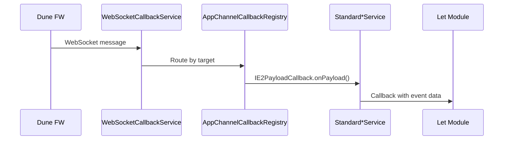

# Hardware Control — Let Implementation Patterns (Dune Platform)

This guide documents how Let modules implement hardware operations via the DeviceServices layer and E2 REST API. Intended for **platform developers** who need to modify, extend, or debug Let implementations.

## 1. Let → E2 API Call Chain

Every hardware operation follows this internal chain:


### Token Selection Rule

| Operation Type | Token Used | Source |
|---|---|---|
| **Read** (get status, capabilities, defaults) | SolutionToken | `AppTokenManager` |
| **Create** (create job, submit) | UIContextToken | `UIContextTokenManager` |
| **Cancel / Delete** (cancel job, delete file) | SolutionToken | `AppTokenManager` |

> The UIContextToken is only valid for the currently active (foreground) solution and is cleared on context switch.

## 2. ScanLet Implementation

### ContentProvider Entry Point

`ScanletContentProvider.call(method, arg, extras)` dispatches by method string:

| Method | DeviceServices Call |
|---|---|
| `IS_SUPPORTED` | `scanDeviceService.isSupported()` |
| `GET_CAPS` | `ScanOptionProfileAdapter.getCapabilities(...)` |
| `GET_DEFAULTS` | `ScanDefaultOptionAdapter.getDefaults(...)` |
| `GET_FILE_OPTIONS_CAPS` | `ScanFileOptionAdapter.getFileOptions(...)` |
| `GET_STATUS` | `ScanDeviceStatusAdapter.getStatus(...)` |
| `GET_FILE_REQ` / `PUT_FILE_REQ` | Local file system operations |

> **Implementation**: ContentProvider uses `StrictMode.ThreadPolicy.permitNetwork()` to allow synchronous E2 calls on the calling thread, restored in `finally` block.

### Adapter Classes

Each Let uses Adapter classes to translate between SDK data models and E2 API schemas:

| Adapter | Purpose |
|---|---|
| `ScanTicketAdapter` | `ScanAttributes` (SDK) → `ScanJob_Create` (E2 schema) |
| `ScanOptionProfileAdapter` | E2 `Profile` → SDK `ScanCapabilities` (extends `BaseOptionProfileAdapter`) |
| `ScanJobStatusAdapter` | E2 `ScanJob` status → SDK status codes |
| `ScanDeviceStatusAdapter` | E2 `Scanner` status → SDK `DeviceStatus` |
| `ScanFileOptionAdapter` | E2 file options → SDK file capabilities |
| `ScanDefaultOptionAdapter` | E2 `DefaultOptions` → SDK defaults |

## 3. Print (OXPPrintLet) — Hybrid Protocol

Unlike scan/copy which use E2 REST exclusively, print uses a **hybrid approach**:

| Operation | Protocol | Details |
|---|---|---|
| **Capabilities** | E2 REST | Via `PrintJobServiceClientImpl` |
| **Job submission** | IPP | Via `IppClient` (HTTP POST to IPP endpoint) |
| **Job status** | CDM REST | Via CDM job management endpoints |

### IPP Endpoint Discovery
1. Query Discovery Tree for GUN `com.hp.standard.feature.pwgIpp`
2. Find link with rel `homeUrl`
3. Fallback: `/ipp/print` (`DEFAULT_IPPENDPOINT` in `StandardDevicePrintJobService`)

### IPP Implementation Classes (in `Libs/OXPPrintLet`)
- `IppClient` — Singleton, sends IPP requests, handles `IPP_PRINTER_BUSY`, `IPP_NOT_AUTHENTICATED`
- `IppConnector` — HTTP transport for IPP
- `IppConstants` — IPP status codes (e.g., `IPP_OK`, `IPP_PRINTER_BUSY(0x0507)`)
- `IppRequest`, `IppResponse` — IPP message encoding/decoding
- `IppAttribute`, `IppStringAttribute`, `IppIntegerAttribute`, etc. — IPP attribute model

## 4. Copy (CopyLet)

Same E2 client pattern as ScanLet:
- GUN: `com.hp.ext.service.copy.version.1`
- Client: `CopyServiceClientImpl`

## 5. E2 Service GUNs

| GUN | Service |
|---|---|
| `com.hp.ext.service.scanJob.version.1` | Scan job management |
| `com.hp.ext.service.printJob.version.1` | Print job management |
| `com.hp.ext.service.copy.version.1` | Copy job management |
| `com.hp.standard.feature.pwgIpp` | IPP print discovery |
| `com.hp.ext.service.application.version.1` | Application management |
| `com.hp.cdm.servicesDiscovery` | Service discovery |

## 6. `StandardDeviceService` Base Class

All `Standard*Service` classes extend `StandardDeviceService`, providing:

```java
// Common infrastructure
protected String getDeviceIPAddress()
protected ServicesDiscoveryImpl getDiscoveryTree()
protected String getSolutionToken(String packageName)   // → AppTokenManager
protected String getUiContextToken(String packageName)  // → UIContextTokenManager
protected boolean isDeviceConnected()

// Execution wrappers
protected <T> T perform(E2call<T> func)
protected <T, P> T perform(E2callUniParam<T, P> func, P param)
protected <T, P, Q> T perform(E2callBiParam<T, P, Q> func, P param1, Q param2)
protected <T> T perform(CdmCall func, Class<T> tClass)
```

### Exception Handling in `perform()`

| Caught Exception | Action |
|---|---|
| Device not connected | `BoundDeviceException("There is no bound device.")` |
| `URISyntaxException` | `BoundDeviceException("Device network address is not a valid URI.")` |
| `ExecutionException` (cause: `OXPdHttpRequestException`) | Rethrown directly |
| `ExecutionException` (other) | `RuntimeException` |
| `InterruptedException` | `RuntimeException` |
| `IOException` | `BoundDeviceException` |

## 7. WebSocket Notification Pattern

Async events from firmware arrive via E2 WebSocket:



Registration: `Standard*Service.registerNotificationCallback()` registers via `AppChannelCallbackRegistry.registerPayloadCallback(GUN, callback)`.

## 8. Adding a New Let Module

Based on the existing module structure:

1. **Interface** (`DeviceServices/Interfaces`):
   - Create `IDeviceNewService.java` with required operations

2. **Standard** (`DeviceServices/Standard`):
   - Create `StandardDeviceNewService extends StandardDeviceService implements IDeviceNewService`
   - Use `perform()` + `E2call` pattern for each method

3. **Sim** (`DeviceServices/Sim`):
   - Create `SimDeviceNewService implements IDeviceNewService`
   - Return mock data for simulator

4. **Let Module** (`Libs/NewLet`):
   - Create adapter classes for SDK ↔ E2 translation
   - Create `NewLetContentProvider` with `call()` dispatch
   - Register ContentProvider in AndroidManifest with proper authority and `SERVICES_PERMISSION`

5. **SDK** (`linksdklib-master`):
   - Add service class in `com.hp.workpath.api.newfeature` package
   - Implement ContentProvider proxy methods in `JetAdvantageLinkLib`
   - Define authority and method constants in `JetAdvantageLinkApi`

6. **Gradle**:
   - Add module to `settings.gradle`: `include ':Let-NewLet'` with `project(':Let-NewLet').projectDir = new File('Libs/NewLet')`
   - Add dependency in `:App-WorkpathServices` build.gradle
