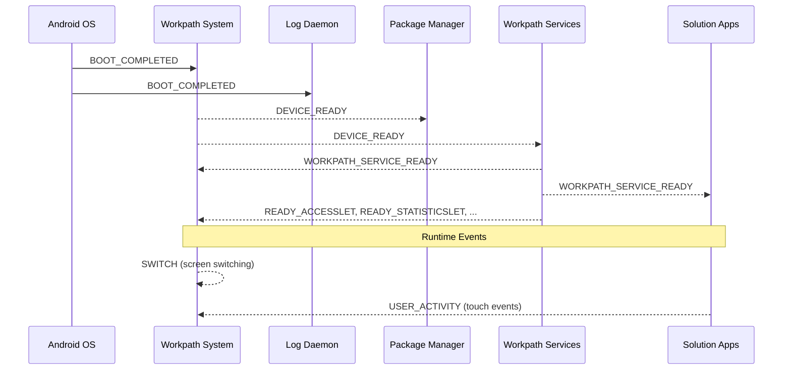

# Broadcast Actions & Intents Reference — Dune Platform

All broadcast actions verified from AndroidManifest definitions across platform repositories.

---

## 1. Protected Broadcasts (Workpath System)

Only system-signed apps can send these broadcasts:

| Broadcast | Purpose |
|---|---|
| `com.hp.workpath.system.DEVICE_READY` | Device initialization complete |
| `com.hp.workpath.system.WORKPATH_SERVICE_READY` | Workpath Services initialized and ready |
| `com.hp.jetadvantage.link.SWITCH` | Screen switch event (Modern UI ↔ Android) |
| `com.hp.jetadvantage.link.receivers.ACTION_POST` | Post action |
| `com.hp.jetadvantage.link.intent.action.CALL_WAKELOCK_CDM` | CDM wake lock management |
| `com.hp.jetadvantage.link.intent.action.CALL_GATEWAY_CLOSE` | Gateway close |
| `com.hp.jetadvantage.link.intent.action.FORCE_REMOVE_TASK` | Force remove task |
| `link.appinfos.runtime` | App runtime info |
| `android.intent.action.STATUS_BAR_CLOCK_CHANGE` | Status bar clock change |

## 2. Boot & Initialization

| Broadcast | Receiver | Component |
|---|---|---|
| `android.intent.action.BOOT_COMPLETED` | `BootCompletedReceiver` | Workpath System |
| `android.intent.action.BOOT_COMPLETED` | `BootCompletedReceiver` | Log Daemon |
| `com.hp.workpath.system.DEVICE_READY` | `DeviceReadyReceiver` | Package Manager |
| `com.hp.workpath.system.DEVICE_READY` | `TestReceiver` | Workpath System |
| `com.hp.workpath.system.WORKPATH_SERVICE_READY` | `TestReceiver` | Workpath System |
| `com.hp.workpath.system.WORKPATH_SERVICE_INIT_COMPLETED` | `ServiceInitCompleteReceiver` | Workpath System |

### Boot Sequence Order
1. `BOOT_COMPLETED` → System + LogDaemon
2. `DEVICE_READY` → Package Manager
3. `WORKPATH_SERVICE_READY` → Solution apps can initialize SDK

## 3. Let Readiness Broadcasts

| Broadcast | Receiver | Component |
|---|---|---|
| `com.hp.jetadvantage.link.action.READY_ACCESSLET` | `WorkpathReadyBroadcastReceiver` | Workpath System |
| `com.hp.jetadvantage.link.action.READY_STATISTICSLET` | `WorkpathReadyBroadcastReceiver` | Workpath System |
| `com.hp.jetadvantage.link.action.READY_STORAGELET` | `WorkpathReadyBroadcastReceiver` | Workpath System |
| `com.hp.jetadvantage.link.action.READY_DEVICEEVENTLET` | `WorkpathReadyBroadcastReceiver` | Workpath System |
| `com.hp.jetadvantage.link.action.READY_ACCESSORYLET` | `WorkpathReadyBroadcastReceiver` | Workpath System |

## 4. Screen Switching

| Broadcast | Receiver | Permission |
|---|---|---|
| `com.hp.jetadvantage.link.SWITCH` | `SwitchReceiver` | `SWITCH_RECEIVER` (signatureOrSystem) |

## 5. Device & Mode Events

| Broadcast | Receiver | Component |
|---|---|---|
| `com.hp.jetadvantage.link.intent.action.EDX_CHANGED` | `ModeReceiver` | Workpath System |
| `com.hp.jetadvantage.link.intent.action.AWAKE_CHANGED` | `ModeReceiver` | Workpath System |
| `com.hp.workpath.intent.action.DEV_TEST` | `ModeReceiver` | Workpath System |
| `com.hp.jetadvantage.link.errorcode` | `ErrorCodeReceiver` | Workpath System |
| `com.hp.jetadvantage.link.notification` | `NotiReceiver` | Workpath System |

## 6. User Activity

| Broadcast | Receiver | Component |
|---|---|---|
| `com.hp.workpath.system.USER_ACTIVITY` | `TouchEventReceiver` | Workpath System |

## 7. CDM & System Management

| Broadcast | Receiver | Component |
|---|---|---|
| `com.hp.workpath.intent.action.CALL_WAKELOCK_CDM` | `CDMCallReceiver` | Workpath System |
| `com.hp.workpath.intent.action.CALL_GATEWAY_CLOSE` | `CDMCallReceiver` | Workpath System |
| `com.hp.workpath.intent.action.FORCE_REMOVE_TASK` | `CDMCallReceiver` | Workpath System |
| `com.hp.workpath.intent.action.CHECK_PROXY_INFO` | `CDMCallReceiver` | Workpath System |
| `com.hp.workpath.intent.action.CALL_DEVICE_READY` | `CDMCallReceiver` | Workpath System |
| `com.hp.workpath.intent.action.TEST_SYSTEM_STATE_CHANGE` | `CDMCallReceiver` | Workpath System |

## 8. Package Manager Events

| Broadcast | Receiver | Permission |
|---|---|---|
| `com.hp.packagemanager.intent.action.DUNE_PACKAGE_ADDED` | `AppInstalledBroadcastReceiver` | — (scheme: package) |
| `com.hp.packagemanager.intent.action.UNINSTALL` | `AppUninstalledBroadcastReceiver` | `PACKAGE_LIFECYCLE_EVENTS` |
| `com.hp.jetadvantage.link.intent.action.ATTESTATION` | `AttestationChangeBroadcastReceiver` | — |
| `com.hp.jetadvantage.link.intent.action.system.NOTIFICATION_CHANGED` | `NotificationChangeBroadcastReceiver` | `READ_PROVIDERS` |

## 9. Test / Debug Actions

| Broadcast | Receiver | Component |
|---|---|---|
| `com.hp.intent.action.TEST_NOTI` | `BootCompletedReceiver` | Workpath System |
| `com.hp.workpath.intent.action.TEST_SYSTEM_STATE_CHANGE` | `CDMCallReceiver` | Workpath System |
| `com.hp.intent.action.logdaemon.start` | `BootCompletedReceiver` | Log Daemon |

### Manual Device Ready Trigger (for development/testing)
```bash
adb shell am broadcast \
  -a com.hp.workpath.intent.action.CALL_DEVICE_READY \
  -n com.hp.jetadvantage.link.system/.receivers.CDMCallReceiver
```

## 10. Broadcast Flow Summary


