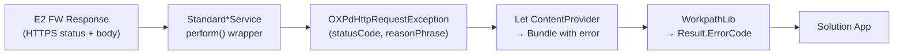

# Error Handling Reference — Dune Platform

This reference documents error handling patterns and exception classes verified from the Workpath platform source code.

---

## 1. Platform Exception Classes

### `OXPdHttpRequestException` (extends RuntimeException)

Source: `Libs/oxpd2/.../OXPdHttpRequestException.java`

Carries the HTTPS response from an E2 API call:

| Field | Type | Description |
|---|---|---|
| `statusCode` | `Integer` | HTTPS status code from E2 API |
| `reasonPhrase` | `String` | HTTPS reason phrase |
| `errorResponse` | `ErrorResponse` | Parsed error response body |

Constructors: no-arg, `(String)`, `(String, Exception)`, `(Integer)`, `(Integer, String)`, `(Integer, ErrorResponse, String)`

> This exception is **rethrown directly** by `StandardDeviceService.perform()` when caught inside an `ExecutionException`.

### `BoundDeviceException` (extends RuntimeException)

Source: `Libs/DeviceServices/Interfaces/.../BoundDeviceException.java`

Thrown when an operation requiring a bound device is attempted when no device is connected, or when the device URI is invalid.

Constructors: no-arg, `(String message)`

### SDK Exceptions (from WorkpathLib)

| Exception Class | Package | Description |
|---|---|---|
| `SsdkUnsupportedException` | `com.hp.workpath.api` | SDK service not installed or version mismatch |
| `CapabilitiesExceededException` | `com.hp.workpath.api` | Requested capability exceeds device limits |

### `Result.ErrorCode` (SDK)

The `Result` class in WorkpathLib carries operation results with error codes via `Result.ErrorCode` enumeration. Specific error code values are defined in the SDK Javadoc.

## 2. E2 API HTTPS Status Handling

The `perform()` wrapper in `StandardDeviceService` handles E2 API responses:

| Scenario | Exception Thrown |
|---|---|
| Device not connected | `BoundDeviceException("There is no bound device.")` |
| Invalid device URI | `BoundDeviceException("Device network address is not a valid URI.")` |
| E2 API returns error HTTPS status | `OXPdHttpRequestException` (with statusCode, reasonPhrase, errorResponse) |
| Network I/O failure | `BoundDeviceException` |
| Thread interrupted | `RuntimeException` |

### Error Propagation Chain



## 3. IPP Status Codes

From `IppConstants.java` in `Libs/OXPPrintLet`:

| Constant | Hex Value | Description |
|---|---|---|
| `IPP_OK` | — | Success |
| `IPP_PRINTER_BUSY` | `0x0507` | Printer is busy |
| `IPP_NOT_AUTHENTICATED` | — | Authentication required |

> `IppClient` handles these status codes and translates them into appropriate actions (retry, error).

## 4. Scanner Status

From `ScannerStatus.java` in `Libs/oxpd`:
- `isBusy` (XML tag: `"isBusy"`) — Boolean indicating scanner busy state

## 5. `perform()` Exception Handling Detail

Verified from `StandardDeviceService.java` (4 overloads, consistent pattern):

```java
protected <T> T perform(E2call<T> func) {
    if (!isDeviceConnected()) {
        throw new BoundDeviceException("There is no bound device.");
    }
    try {
        return func.request();
    } catch (URISyntaxException e) {
        throw new BoundDeviceException("Device network address is not a valid URI.");
    } catch (ExecutionException e) {
        if (e.getCause() instanceof OXPdHttpRequestException) {
            throw (OXPdHttpRequestException) e.getCause();  // rethrown directly
        }
        throw new RuntimeException(e);
    } catch (InterruptedException e) {
        throw new RuntimeException(e);
    } catch (IOException e) {
        throw new BoundDeviceException("IOException:" + e.getCause());
    }
}
```

The `E2callBiParam` overload additionally handles `JsonProcessingException` → `RuntimeException`.

## 6. Device Connection Errors

| Exception | Source Module | Description |
|---|---|---|
| `BoundDeviceException` | DeviceServices-Interfaces | Failed to connect to bound device or invalid device URI |
| `AuthorizationException` | DeviceConnect | Authorization failure in device communication |

## 7. WebSocket Connection Issues

WebSocket connection management is handled by `Transport` / `E2WebSocektListener` in Workpath System. Connection state can be monitored through `[SSS][SystemService]` log tags.

> For debugging WebSocket and other platform issues, see [Debugging & Troubleshooting](../03_Guides/Debugging.md).
