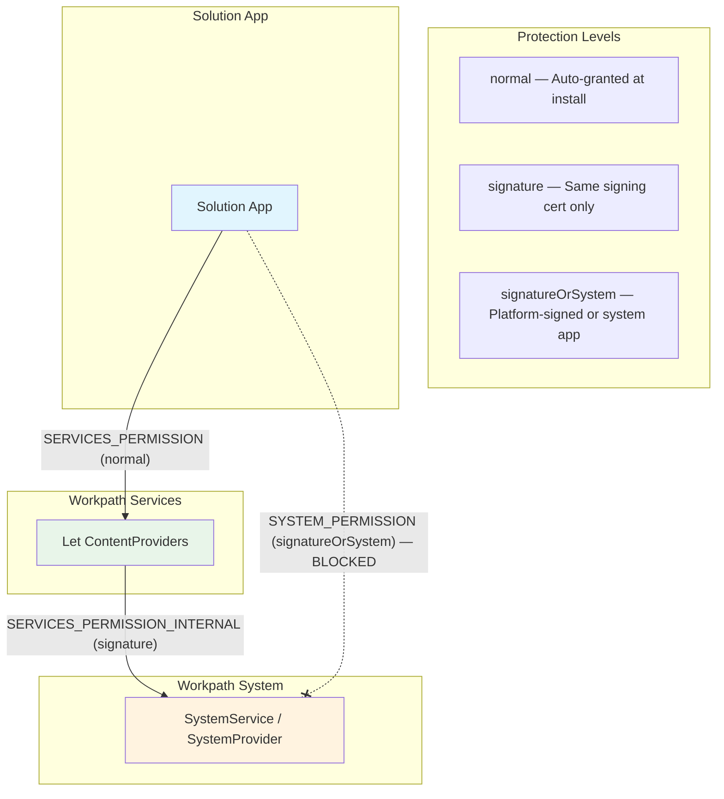

# Permissions Reference — Dune Platform

This document lists all Workpath-defined Android permissions verified from AndroidManifest and build.gradle files across all platform repositories.

---

## 1. SDK Permissions (Defined by Workpath Services)

| Permission | Protection Level | Purpose |
|---|---|---|
| `com.hp.jetadvantage.link.permission.SERVICES_PERMISSION` | `normal` | Access to Workpath SDK services (Lets). Required by all solution apps. Auto-granted at install. |
| `com.hp.jetadvantage.link.permission.SERVICES_PERMISSION_INTERNAL` | `signature` | Internal-only broadcasts between Workpath platform components. |
| `com.hp.workpath.permission.sdk.ACCESS_DEVICE_EVENTS_PERMISSION` | `normal` | Subscribe to device events via DeviceEventsLet. |
| `com.hp.workpath.permission.sdk.ACCESS_DEVICE_USAGE_PERMISSION` | `normal` | Access device usage data via DeviceUsageLet. |
| `com.hp.workpath.permission.sdk.ACCESS_STATISTICS_PERMISSION` | `normal` | Access print/scan statistics via StatisticsLet. |
| `com.hp.workpath.permission.sdk.ACCESS_SUPPLIES_PERMISSION` | `normal` | Read supply levels via SuppliesLet. |

## 2. System Permissions (Defined by Workpath System)

| Permission | Protection Level | Purpose |
|---|---|---|
| `com.hp.jetadvantage.link.system.SYSTEM_PERMISSION` | `signatureOrSystem` | Access to SystemService and SystemProvider. |
| `com.hp.jetadvantage.link.system.SWITCH_RECEIVER` | `signatureOrSystem` | Send/receive screen switch events. |
| `com.hp.workpath.system.ENABLED_PACKAGES_PERMISSION` | `signatureOrSystem` | Manage enabled/disabled packages list. |

## 3. Package Manager Permissions

| Permission | Protection Level | Group | Purpose |
|---|---|---|---|
| `com.hp.packagemanager.permission.LIST_PACKAGES` | `signatureOrSystem` | `PACKAGE_MANAGER` | Query list of installed HPK packages. |
| `com.hp.packagemanager.permission.PACKAGE_LIFECYCLE_EVENTS` | `signatureOrSystem` | `PACKAGE_MANAGER` | Receive app install/uninstall notifications. |
| `com.hp.packagemanager.permission.READ_PROVIDERS` | `signatureOrSystem` | `PACKAGE_MANAGER` | Read Package Manager content providers. |
| `com.hp.packagemanager.permission.READ_WRITE_CONFIG` | `signatureOrSystem` | `PACKAGE_MANAGER` | Read/write configuration. |
| `com.hp.packagemanager.permission.READ_WRITE_SYSTEMCONFIG` | `signatureOrSystem` | `PACKAGE_MANAGER` | Read/write system configuration. |
| `com.hp.packagemanager.permission.READ_WRITE_AVATAR_REGISTRATION` | `signatureOrSystem` | `PACKAGE_MANAGER` | Avatar registration. |
| `com.hp.packagemanager.permission.READ_WRITE_ATTESTATION` | `signatureOrSystem` | `PACKAGE_MANAGER` | Read/write attestation data. |
| `com.hp.workpath.permission.ACCESS_CUSTOM_AUTH` | `normal` | `PACKAGE_MANAGER` | Custom authentication access. |

## 4. Log Daemon Permission

| Permission | Protection Level | Purpose |
|---|---|---|
| `com.hp.jetadvantage.link.system.LOGDAEMON_PERMISSION` | `signatureOrSystem` | Access to LogcatService. |

---

## 5. Permission Requirements by Feature

| Feature | Required Permission(s) |
|---|---|
| Basic SDK access (scan, print, copy, device info) | `SERVICES_PERMISSION` |
| Device events subscription | `SERVICES_PERMISSION` + `ACCESS_DEVICE_EVENTS_PERMISSION` |
| Device usage data | `SERVICES_PERMISSION` + `ACCESS_DEVICE_USAGE_PERMISSION` |
| Statistics | `SERVICES_PERMISSION` + `ACCESS_STATISTICS_PERMISSION` |
| Supply levels | `SERVICES_PERMISSION` + `ACCESS_SUPPLIES_PERMISSION` |
| Full feature set | All of the above + `INTERNET`, `READ_EXTERNAL_STORAGE`, `WRITE_EXTERNAL_STORAGE` |

## 6. Permission Access Flow

> **Key**: Solution apps **cannot** directly access Workpath System's SystemService or SystemProvider because they are protected by `signatureOrSystem` permissions. All access goes through Workpath Services as a proxy.

## 7. Permissions Used by Platform Components

### Workpath Services Uses
`INTERNET`, `ACCESS_NETWORK_STATE`, `CHANGE_WIFI_STATE`, `READ_EXTERNAL_STORAGE`, `WRITE_EXTERNAL_STORAGE`, `WRITE_SETTINGS`, `READ_SYNC_STATS`, `VIBRATE`, `GET_TASKS`, `SYSTEM_ALERT_WINDOW`, `FOREGROUND_SERVICE`

Plus cross-component: `SYSTEM_PERMISSION`, `LIST_PACKAGES`, `PACKAGE_LIFECYCLE_EVENTS`, `READ_PROVIDERS`

### Workpath System Uses
`WRITE_EXTERNAL_STORAGE`, `INTERNET`, `RECEIVE_BOOT_COMPLETED`, `CHANGE_CONFIGURATION`, `REMOVE_TASKS`, `SET_TIME`, `SET_TIME_ZONE`, `WRITE_SETTINGS`, `READ_SETTINGS`, `WRITE_SECURE_SETTINGS`, `WAKE_LOCK`, `GET_TASKS`, `SET_KEYBOARD_LAYOUT`, `REORDER_TASKS`, `BIND_NOTIFICATION_LISTENER_SERVICE`, `FOREGROUND_SERVICE`, `SYSTEM_ALERT_WINDOW`

Plus cross-component: `LIST_PACKAGES`, `PACKAGE_LIFECYCLE_EVENTS`, `READ_WRITE_PROVIDERS` (datacollector)

### Package Manager Uses
`INTERNET`, `ACCESS_WIFI_STATE`, `READ_EXTERNAL_STORAGE`, `WRITE_EXTERNAL_STORAGE`, `INSTALL_PACKAGES`, `DELETE_PACKAGES`, `WRITE_SETTINGS`, `GRANT_RUNTIME_PERMISSIONS`, `SYSTEM_ALERT_WINDOW`, `FOREGROUND_SERVICE`

Plus cross-component: `SYSTEM_PERMISSION`, `READ_WRITE_PROVIDERS` (datacollector), `ACCESS_STATISTICS_PERMISSION`, `svcmanager.ACCESS_PROVIDERS`

### Log Daemon Uses
`INTERNET`, `RECEIVE_BOOT_COMPLETED`, `READ_LOGS`, `READ_EXTERNAL_STORAGE`, `WRITE_EXTERNAL_STORAGE`, `READ_INTERNAL_STORAGE`, `WRITE_INTERNAL_STORAGE`, `GET_TASKS`

Plus cross-component: `INSTALL_PACKAGES` (packagemanager)
