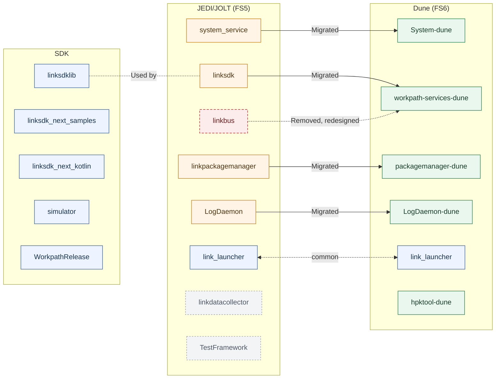

# Repository Map — Workpath Platform

This document provides a complete map of all active source code repositories for the Workpath Platform, organized by firmware generation (Dune vs. JEDI/JOLT). Platform code is managed in **separate repositories per firmware generation**.

---

## 1. Workpath Platform Services — Dune (FS6)

**GitHub Organization**: [https://github.azc.ext.hp.com/workpath-dune](https://github.azc.ext.hp.com/workpath-dune)

These repositories produce the Workpath platform components that run on Dune (Future Smart 6) firmware devices.

| Repository | URL | Description | Output |
|---|---|---|---|
| **hpktool-dune** | [workpath-dune/hpktool-dune](https://github.azc.ext.hp.com/workpath-dune/hpktool-dune) | Repository containing the source code for the Workpath HPKv2 app bundle packaging tool for Dune. | GUI, CLI tool |
| **LogDaemon-dune** | [workpath-dune/LogDaemon-dune](https://github.azc.ext.hp.com/workpath-dune/LogDaemon-dune) | Repository containing the source code for the Workpath logging daemon for Dune. | `LogDaemon-dune.apk` |
| **packagemanager-dune** | [workpath-dune/packagemanager-dune](https://github.azc.ext.hp.com/workpath-dune/packagemanager-dune) | Repository containing the source code for the Workpath package manager, which installs, uninstalls, and manages Workpath apps for Dune. | `WorkpathPackageManager-dune.apk` |
| **System-dune** | [workpath-dune/System-dune](https://github.azc.ext.hp.com/workpath-dune/System-dune) | Repository containing the source code for the Workpath system service for Dune. | `System-dune.apk` |
| **workpath-services-dune** | [workpath-dune/workpath-services-dune](https://github.azc.ext.hp.com/workpath-dune/workpath-services-dune) | Repository containing the source code for the Workpath API service implementations for Dune, including AccessService, AccessoryService, ConfigService, CopierService, DeviceService, JobService, PrinterService, ScannerService, and related services. | `WorkpathServices-dune.apk` |

---

## 2. Workpath SDK — Common

**GitHub Organizations**: [https://github.azc.ext.hp.com/sdk](https://github.azc.ext.hp.com/sdk), [https://github.azc.ext.hp.com/system](https://github.azc.ext.hp.com/system)

These repositories produce the Workpath platform components that run on JEDI/JOLT (Future Smart 5) firmware devices.

| Repository | URL | Description | Output |
|---|---|---|---|
| **linksdk_next_kotlin** | [sdk/linksdk_next_kotlin](https://github.azc.ext.hp.com/sdk/linksdk_next_kotlin) | Repository containing Kotlin sample application source code for the Workpath SDK. | — |
| **linksdk_next_samples** | [sdk/linksdk_next_samples](https://github.azc.ext.hp.com/sdk/linksdk_next_samples) | Repository containing Java sample application source code for the Workpath SDK. | — |
| **linksdklib** | [sdk/linksdklib](https://github.azc.ext.hp.com/sdk/linksdklib) | Repository containing the source code for the Workpath SDK libraries. | — |
| **simulator** | [sdk/simulator](https://github.azc.ext.hp.com/sdk/simulator) | Repository containing the source code and related resources for the Workpath SDK simulator. | — |
| **WorkpathRelease** | [sdk/WorkpathRelease](https://github.azc.ext.hp.com/sdk/WorkpathRelease) | Repository containing Workpath SDK release assets, including API Javadoc, technical documentation, libraries, Java and Kotlin sample apps, development tools, and simulator resources. | — |

---
## 2. Workpath Platform Services — Jedi/Jolt (FS5)

**GitHub Organizations**: [https://github.azc.ext.hp.com/sdk](https://github.azc.ext.hp.com/sdk), [https://github.azc.ext.hp.com/system](https://github.azc.ext.hp.com/system)

These repositories produce the Workpath platform components that run on JEDI/JOLT (Future Smart 5) firmware devices.

| Repository | URL | Description | Output |
|---|---|---|---|
| **link_launcher** | [system/link_launcher](https://github.azc.ext.hp.com/system/link_launcher) | Repository containing the source code for the default Workpath launcher app. | Launcher APK |
| **linkbus** | [sdk/linkbus](https://github.azc.ext.hp.com/sdk/linkbus) | Repository containing the source code for the Workpath web service. | `WorkpathWebServicesManager.apk` |
| **linkdatacollector** | [sdk/linkdatacollector](https://github.azc.ext.hp.com/sdk/linkdatacollector) | Repository containing the source code for the Workpath data collection component. | `JetAdvantageLinkDataCollector.apk` |
| **linkpackagemanager** | [sdk/linkpackagemanager](https://github.azc.ext.hp.com/sdk/linkpackagemanager) | Repository containing the source code for the Workpath package manager, which installs, uninstalls, and manages Workpath applications, as well as the HPK package tool. | `JetAdvantageLinkPackageManager.apk` + HPK tool |
| **LogDaemon** | [system/LogDaemon](https://github.azc.ext.hp.com/system/LogDaemon) | Repository containing the source code for the Workpath logging daemon. | `LogDaemon.apk` |
| **system_service** | [system/system_service](https://github.azc.ext.hp.com/system/system_service) | Repository containing the source code for the Workpath system service. | `System.apk` |
| **TestFramework** | [sdk/TestFramework](https://github.azc.ext.hp.com/sdk/TestFramework) | Repository for test frameworks, batch utilities, and GFriend-based automation scripts for HP Workpath. | — |

---

## 3. JEDI/JOLT → Dune Component Evolution

| JEDI/JOLT Repo | Dune Equivalent | Migration Notes |
|---|---|---|
| `system_service` | `System-dune` | Migrated with Dune-specific adaptations |
| `linksdk` | `workpath-services-dune` | Migrated with Dune-specific adaptations |
| `linkbus` | *(removed)* | Webhook is newly designed and integrated into `workpath-services-dune` |
| `linkpackagemanager` | `packagemanager-dune` | Migrated with Dune-specific adaptations |
| `LogDaemon` | `LogDaemon-dune` | Migrated with Dune-specific adaptations |
| `link_launcher` | *(common)* | common |
| `linkdatacollector` | *(not used)* | N/A |

---

## 4. Repository Architecture Diagram

