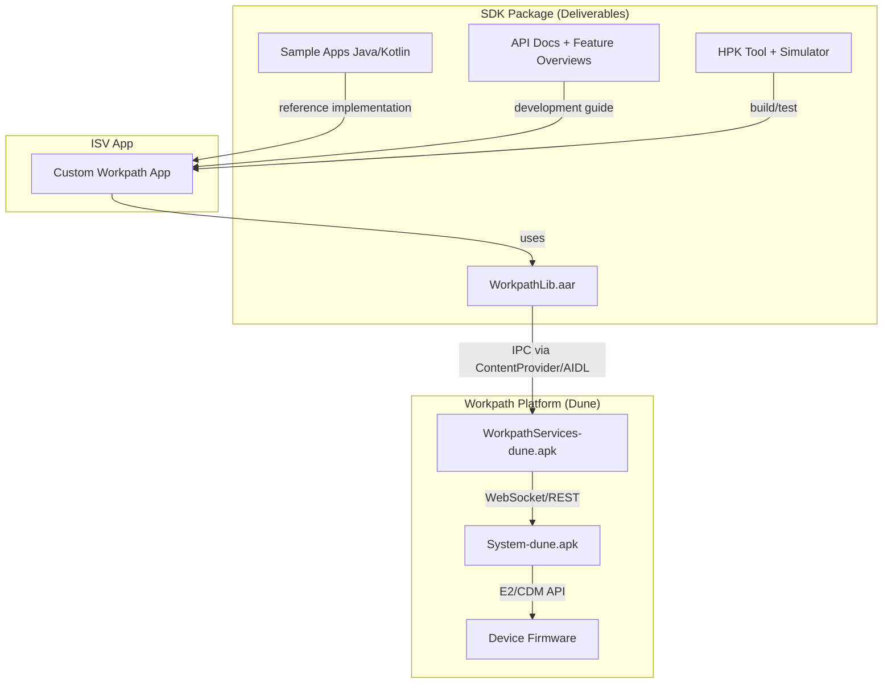

# SDK Package Overview

> **Audience**: Workpath SDK developers
> **Version**: HP Workpath SDK v1.6.3

---

## 1. Purpose

The HP Workpath SDK enables development of Workpath apps that run on HP MFP (Multi-Function Printer) devices. The SDK team develops and distributes the following deliverables as a single package with each release:

1. **WorkpathLib.aar** — Core SDK library (Android AAR)
2. **API Documentation** — Javadoc-based API reference
3. **Feature Overview Documents** — Per-feature PDF guides (21 documents) + SDK User Guide
4. **Sample Applications** — 23 Java + 23 Kotlin sample apps
5. **Extension Samples** — GoogleSigninSample and other extension samples
6. **HPK Tool** — APK-to-HPK packaging tool (Windows/Linux)
7. **Simulator** — PC-based development/testing simulator
8. **Release Notes** — Per-release change log

---

## 2. Target Users

The end users of the SDK package are **external ISVs (Independent Software Vendors)** and **internal Workpath app developers**.

| User | Purpose |
|------|---------|
| ISV developers | Build custom Workpath apps using WorkpathLib.aar |
| Solution partners | Build solution apps based on sample apps |
| HP internal developers | SDK feature verification and integration testing |
| QA teams | Test automation using Simulator |

---

## 3. SDK Architecture Position

WorkpathLib.aar is the **abstraction layer** between SDK apps and the Workpath Platform. Apps only call the library's APIs; the Platform handles actual printer communication.

---

## 4. Version History

| Version | SDK API Level | Key Changes |
|---------|--------------|-------------|
| v1.6.3 | API 9+ | Current release — Broadcast actions, DeviceSettings permissions |
| v1.6.x | API 9 | Sleep/Wakeup events, Config change notifications |
| v1.5.x | API 5–8 | DeviceEvents, DeviceUsage, Statistics, Supplies permissions |
| v1.0.x | API 1–4 | Initial SDK — Scan, Print, Copy, Access, Config |

> SDK API Level maps to the Workpath Platform version and represents the SDK's own capability level, not the app's `targetSdkVersion`.

---

## 5. Key Concepts

### 5.1 WorkpathLib vs Workpath Platform

| Aspect | WorkpathLib (SDK) | Workpath Platform |
|--------|-------------------|-------------------|
| Location | Bundled in ISV app (AAR) | Pre-installed on device |
| Role | Provides API interface | Executes APIs (printer communication) |
| Update cycle | On SDK release | On OTA firmware update |
| Owner | SDK team | Platform team |

### 5.2 HPK (HP Workpath Package)

HPK is the installable package format for HP printers:
- APKs are converted to HPK for distribution
- HPKTool performs the conversion
- Package Manager handles installation on the device

### 5.3 Simulator

The Simulator provides a development/testing environment on PC without a physical printer:
- Windows-based installer
- Emulates printer hardware behavior
- Shortens the development cycle

---

*→ Next: [Release Package Structure](Release_Package_Structure.md)*
