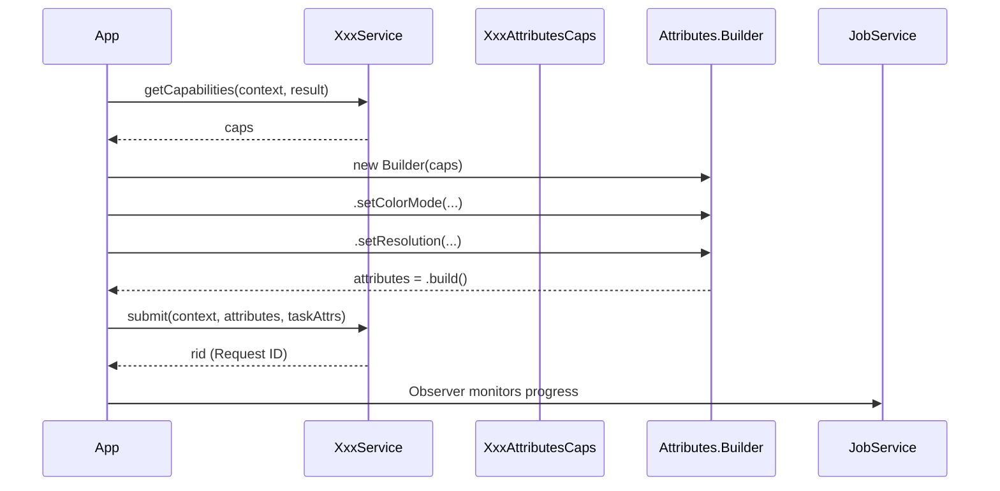

# API Patterns

> **Audience**: Workpath SDK developers
> **Version**: HP Workpath SDK v1.6.3

---

## 1. SDK Initialization Pattern

Every Workpath app must initialize the SDK before using any API.

```java
// Step 1: Initialize (on background thread)
try {
    Workpath.getInstance().initialize(context);
} catch (SsdkUnsupportedException e) {
    // LIBRARY_NOT_INSTALLED or LIBRARY_UPDATE_IS_REQUIRED
} catch (SecurityException e) {
    // Insufficient permissions
}

// Step 2: Check service support
if (!ScannerService.isSupported(context)) {
    // Scanner not supported on this device
}
if (!JobService.isSupported(context)) {
    // Job service not supported
}

// Step 3: Check version (optional)
int versionCode = Workpath.getInstance().getVersionCode();
String versionName = Workpath.getInstance().getVersionName();
```

> **SDK developer note**: The error type of `SsdkUnsupportedException` is determined by the mapping between Platform version and SDK version. When adding new APIs, the API Level must be incremented accordingly.

---

## 2. Service + Capabilities + Builder Pattern

The core pattern for Scan/Print/Copy is identical:



### 2.1 Scanner Example

```java
// 1. Query capabilities
Result result = new Result();
ScanAttributesCaps caps = ScannerService.getCapabilities(context, result);

// 2. Build attributes (Builder pattern)
ScanAttributes attributes = new ScanAttributes.MeBuilder(caps)
    .setColorMode(ColorMode.COLOR)
    .setResolution(Resolution.DPI_300)
    .setDocumentFormat(DocumentFormat.PDF)
    .setDuplex(Duplex.SIMPLEX)
    .build();

// 3. Task attributes (UI behavior settings)
ScanletAttributes taskAttribs = new ScanletAttributes.Builder()
    .setShowSettingsUi(false)
    .setAllowMultipleScan(true)
    .build();

// 4. Submit job → returns Request ID
String rid = ScannerService.submit(context, attributes, taskAttribs);
```

### 2.2 Printer Example — Various Sources

```java
// Print from storage
PrintAttributes attrs = new PrintAttributes.PrintFromStorageBuilder(storageUri)
    .setColorMode(ColorMode.COLOR)
    .setDuplex(Duplex.DUPLEX_LONG_EDGE)
    .setPaperSize(PaperSize.A4)
    .build();
String rid = PrinterService.submit(context, attrs, taskAttrs);

// Print from HTTP
PrintAttributes httpAttrs = new PrintAttributes.PrintFromHttpBuilder(httpUri)
    .build();

// Print from USB
PrintAttributes usbAttrs = new PrintAttributes.PrintFromUsbBuilder(usbPath)
    .build();

// Print from stream
PrintAttributes streamAttrs = new PrintAttributes.PrintFromStreamBuilder(inputStream)
    .build();

// Batch print (multiple documents at once)
List<PrintAttributes> batch = Arrays.asList(attrs1, attrs2, attrs3);
PrinterService.submit(context, batch, taskAttrs);
```

### 2.3 Copier Example

```java
CopyAttributesCaps caps = CopierService.getCapabilities(context, result);
CopyAttributes attrs = new CopyAttributes.CopyBuilder(caps)
    .setColorMode(ColorMode.COLOR)
    .setCopies(3)
    .setDuplex(Duplex.DUPLEX_LONG_EDGE)
    .build();
String rid = CopierService.submit(context, attrs, taskAttribs);

// Stored copy job
CopyAttributes storeAttrs = new CopyAttributes.StoreCopyBuilder(caps)
    .setRetentionMode(RetentionMode.STORE)
    .build();
```

---

## 3. Job Observer Pattern

Callback pattern for monitoring job progress:

```java
// Create observer
Handler handler = new Handler(Looper.getMainLooper());
JobService.AbstractJobletObserver observer = new JobService.AbstractJobletObserver(handler) {
    @Override
    public void onProgress(String rid, JobInfo jobInfo) {
        // Progress update
        ScanJobState state = (ScanJobState) jobInfo.getJobState();
        int progress = state.getProgress();
    }

    @Override
    public void onComplete(String rid, JobInfo jobInfo) {
        // Completion handling
    }

    @Override
    public void onFail(String rid, Result result) {
        // Failure handling — check result.getErrorCode() for cause
    }

    @Override
    public void onCancel(String rid) {
        // Cancellation handling
    }
};

// Register/unregister (tied to Activity lifecycle)
@Override
protected void onResume() {
    super.onResume();
    observer.register(context);
}

@Override
protected void onPause() {
    super.onPause();
    observer.unregister(context);
}

// Foreground monitoring (displays job UI)
JobService.monitorJobInForeground(context, jobId, taskAttributes, intent);

// Cancel a job
JobService.cancelJob(context, jobId);

// Query job info
JobInfo jobInfo = JobService.getJobInfo(context, jobId, result);
```

---

## 4. Observer Pattern (Non-Job)

In addition to jobs, Config, MassStorage, DeviceEvents, and Statistics also use Observers:

### 4.1 Config Change Observer

```java
ConfigService.AbstractConfigChangeObserver configObserver =
    new ConfigService.AbstractConfigChangeObserver(handler) {
        @Override
        public void onChange() {
            // Config change detected
        }
    };
configObserver.register(context);
```

### 4.2 Mass Storage Change Observer

```java
MassStorageService.AbstractMassStorageChangeObserver storageObserver =
    new MassStorageService.AbstractMassStorageChangeObserver(handler) {
        @Override
        public void onChange() {
            // USB device inserted/removed
        }
    };
storageObserver.register(context);
```

### 4.3 Device Events Observer

```java
DeviceEventsService.AbstractDeviceEventsChangeObserver eventsObserver =
    new DeviceEventsService.AbstractDeviceEventsChangeObserver(handler) {
        @Override
        public void onChange(DeviceEvent event) {
            // Device event occurred
        }
    };
eventsObserver.register(context);
```

---

## 5. Result Pattern

All API call results are delivered through the `Result` object:

```java
Result result = new Result();
ScanAttributesCaps caps = ScannerService.getCapabilities(context, result);

if (result.getCode() == Result.RESULT_OK) {
    // Success — use caps
} else {
    // Failure
    Result.ErrorCode errorCode = result.getErrorCode();
    String cause = result.getCause();

    switch (errorCode) {
        case INVALID_PARAM:     // Parameter error
        case CONNECTION_ERROR:  // Connection failure
        case SERVICE_ERROR:     // Service error
        case NOT_SUPPORTED:     // Not supported
        case UNAUTHORIZED:      // Not authorized
        case UNAVAILABLE:       // Unavailable (API 9)
        default:                // UNKNOWN
    }
}
```

---

## 6. Web Service Pattern

Pattern for implementing custom web service endpoints:

```java
public class MyWebService extends AbstractWebServices {
    @Override
    protected void onStart() {
        callback = new MyCallback();
    }

    static class MyCallback implements Callback {
        @Override
        public boolean authenticated(HttpRequest request) {
            // Verify authentication
            return true;
        }

        @Override
        public HttpResponse get(HttpRequest request) {
            // Handle GET request
            return new HttpResponse(200, "OK", body);
        }

        @Override
        public HttpResponse post(HttpRequest request) {
            // Handle POST request
        }

        @Override
        public HttpResponse put(HttpRequest request) {
            // Handle PUT request
        }

        @Override
        public HttpResponse delete(HttpRequest request) {
            // Handle DELETE request
        }
    }
}
```

---

## 7. Authentication Agent Pattern

Pattern for implementing custom authentication agents:

```java
public class MyAuthAgent extends AbstractAuthenticationService {
    @Override
    protected void onSignIn(SignInAction action) {
        // Display sign-in UI
        // action.getAction() → SignInAction.Action
    }

    @Override
    protected void onSignOut() {
        // Handle sign-out
    }

    // Return authentication result
    AuthenticationAttributes attrs = new AuthenticationAttributes.WindowsBuilder()
        .setUsername(username)
        .setPassword(password)
        .setDomain(domain)
        .build();
    deliverSignInResult(attrs);
}
```

---

## 8. Broadcast Receiver Pattern (API 9+)

Pattern for receiving system events:

```java
// AndroidManifest.xml
<receiver android:name=".SleepWakeUpReceiver">
    <intent-filter>
        <action android:name="com.hp.workpath.action.WAKE_UP"/>
        <action android:name="com.hp.workpath.action.SLEEP"/>
    </intent-filter>
</receiver>

// Permission declaration
<uses-permission android:name="com.hp.workpath.permission.RECEIVE_SLEEP_WAKEUP_EVENT"/>
```

```java
public class SleepWakeUpReceiver extends BroadcastReceiver {
    @Override
    public void onReceive(Context context, Intent intent) {
        String action = intent.getAction();
        if ("com.hp.workpath.action.WAKE_UP".equals(action)) {
            // Device woke up
        } else if ("com.hp.workpath.action.SLEEP".equals(action)) {
            // Device entering sleep
        }
    }
}
```

---

## 9. Async Execution Pattern

### 9.1 Java — ExecutorService + Handler

```java
ExecutorService executor = Executors.newSingleThreadExecutor();
Handler handler = new Handler(Looper.getMainLooper());

executor.execute(() -> {
    // Background — SDK API calls
    Workpath.getInstance().initialize(context);
    ScanAttributesCaps caps = ScannerService.getCapabilities(context, result);

    handler.post(() -> {
        // UI thread — display results
        updateUI(caps);
    });
});
```

### 9.2 Kotlin — Coroutines

```kotlin
lifecycleScope.launch(Dispatchers.Default) {
    // Background — SDK API calls
    Workpath.getInstance().initialize(context)
    val caps = ScannerService.getCapabilities(context, result)

    withContext(Dispatchers.Main) {
        // UI thread — display results
        updateUI(caps)
    }
}
```

---

## 10. Pattern Summary

| Pattern | Where Used | Key Class |
|---------|-----------|-----------|
| Singleton + Initialize | All apps | `Workpath.getInstance()` |
| Service + Capabilities + Builder | Scan, Print, Copy | `XxxService`, `XxxAttributesCaps`, `XxxAttributes.Builder` |
| Job Observer | Scan, Print, Copy | `JobService.AbstractJobletObserver` |
| Change Observer | Config, MassStorage, DeviceEvents, Statistics | `AbstractXxxChangeObserver` |
| Result | All API calls | `Result`, `Result.ErrorCode` |
| Web Service Callback | Custom endpoints | `AbstractWebServices`, `Callback` |
| Authentication Agent | Custom auth | `AbstractAuthenticationService` |
| Broadcast Receiver | System events (API 9) | Standard `BroadcastReceiver` |

---

*→ Next: [Sample Apps Overview](../03_Samples/Sample_Apps_Overview.md)*
