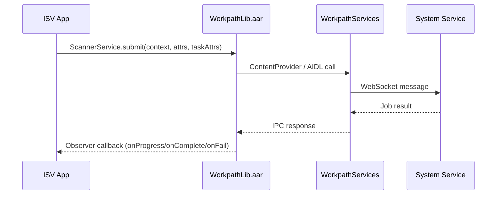

# WorkpathLib

> **Audience**: Workpath SDK developers
> **Version**: HP Workpath SDK v1.6.3

---

## 1. Overview

`WorkpathLib.aar` is the core library of the HP Workpath SDK. ISV apps include this library to access printer hardware features such as scanning, printing, and copying on HP devices.

| Property | Value |
|----------|-------|
| Filename | `WorkpathLib.aar` |
| Format | Android Archive (AAR) |
| Root package | `com.hp.workpath.api` |
| API Level | 9 (as of v1.6.3) |
| Build tool | Javadoc `1.8.0_292` |

---

## 2. Library Integration

### 2.1 Reference Method in Gradle Projects

The SDK package wraps the AAR as a **local module** for Gradle dependency resolution:

**WorkpathLib/build.gradle** (wrapper module):
```gradle
configurations.maybeCreate("default")
artifacts.add("default", file('WorkpathLib.aar'))
```

**settings.gradle** (project root):
```gradle
include ':WorkpathLib'
include ':ScanSample'
include ':PrintSample'
// ... 23 sample modules
```

**App module build.gradle**:
```gradle
dependencies {
    implementation project(':WorkpathLib')
}
```

> This is the standard pattern for using a local AAR as a Gradle dependency without a Maven repository.

### 2.2 Integration in ISV Apps

ISVs can integrate WorkpathLib using one of two methods:

**Method A — Local module (same as samples)**:
```
app/
├── build.gradle          → implementation project(':WorkpathLib')
WorkpathLib/
├── build.gradle          → artifacts.add("default", file('WorkpathLib.aar'))
└── WorkpathLib.aar
```

**Method B — Direct libs folder reference**:
```gradle
dependencies {
    implementation files('libs/WorkpathLib.aar')
}
```

---

## 3. Internal Dependencies

Open source libraries used internally by WorkpathLib.aar:

| Library | Version | Purpose |
|---------|---------|---------|
| Google Gson | 2.8.1 | JSON serialization/deserialization |
| Simple XML Framework | 2.7.1-3 | XML parsing (OXPd communication) |
| Android Support Library | 26.1.0 | AndroidX compatibility support |

> These dependencies are bundled inside the AAR; apps do not need to add them separately.

---

## 4. Communication Architecture

WorkpathLib is the IPC (Inter-Process Communication) layer between the app and the Workpath Platform:



**Key points**:
- Apps only call Service classes in `WorkpathLib`
- The library communicates with the Platform internally via `ContentProvider` or `AIDL`
- Async results are delivered through the `Observer` callback pattern

---

## 5. Compatibility

### 5.1 Android Configuration

| Setting | Value |
|---------|-------|
| compileSdkVersion | 31 |
| minSdkVersion | 31 |
| targetSdkVersion | 31 |
| Java compatibility | Java 11 |
| multiDexEnabled | true |

### 5.2 Platform Compatibility

| SDK Version | Required Platform Version | Dune Firmware |
|-------------|--------------------------|---------------|
| v1.6.3 | WorkpathServices v1.6.3+ | FS6-based |

> If the Platform version does not match, `Workpath.getInstance().initialize(context)` throws `SsdkUnsupportedException`.

### 5.3 SsdkUnsupportedException

| Error Case | Description |
|------------|-------------|
| `LIBRARY_NOT_INSTALLED` | Workpath Platform is not installed on the device |
| `LIBRARY_UPDATE_IS_REQUIRED` | Platform version is lower than the SDK requirement |

---

## 6. Javadoc Archive

| File | Description |
|------|-------------|
| `WorkpathLib-javadoc.jar` | Javadoc JAR for IDE integration (source attachment) |
| `WorkpathLib-javadoc/` | Browsable HTML — starts from `index.html` |

Javadoc is generated with `javadoc (1.8.0_292)` and documents all public APIs across 34 packages.

---

## 7. SDK Developer Responsibilities

Tasks SDK developers must perform when releasing WorkpathLib.aar:

1. **API implementation** — Add new APIs or modify existing ones
2. **Javadoc authoring** — Write Javadoc comments for all public classes/methods
3. **AAR build** — Extract AAR from Release build
4. **Javadoc generation** — Generate HTML + JAR output
5. **Sample updates** — Reflect new API usage examples in sample apps
6. **Compatibility testing** — Verify IPC communication with Platform
7. **Open source notice update** — Update when dependencies change

---

*→ Next: [API Surface](API_Surface.md)*
