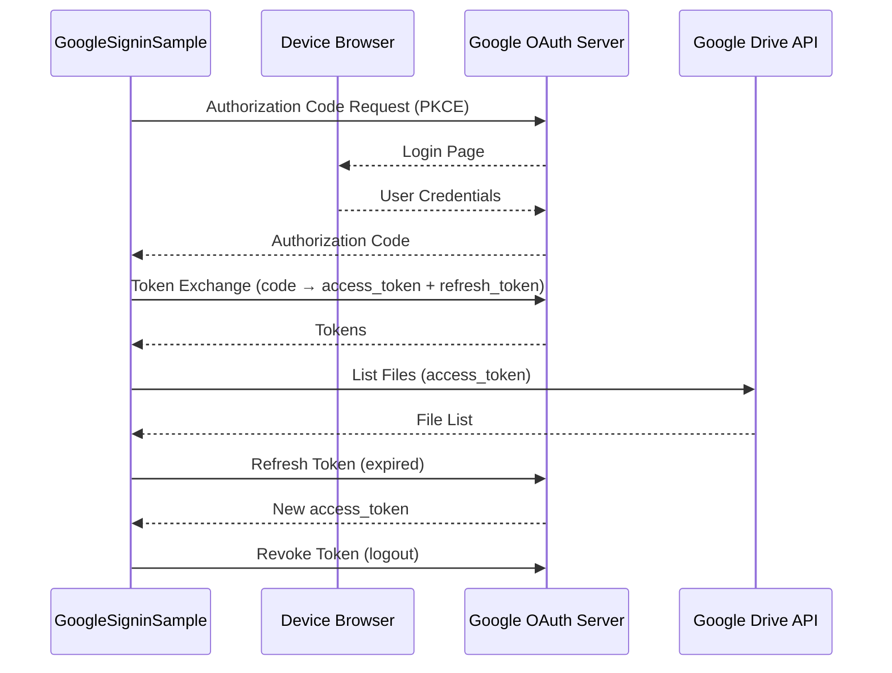

# Extensions

> **Audience**: Workpath SDK developers
> **Version**: HP Workpath SDK v1.6.3

---

## 1. Overview

Extension samples are **separate projects from ExampleAPIServices**, demonstrating **external service integration** rather than Workpath SDK APIs. Currently, one extension is provided in both Java and Kotlin.

| Extension | Language | Path |
|-----------|----------|------|
| GoogleSigninSample | Java | `Samples/ExampleExtensions/source/GoogleSigninSample/` |
| GoogleSigninSample | Kotlin | `Samples_Kotlin/ExampleExtensions/source/GoogleSigninSample/` |

---

## 2. GoogleSigninSample

### 2.1 Purpose

Demonstrates **Google OAuth 2.0 authentication** on an HP printer device and displays a **Google Drive** file listing. This sample does not use Workpath SDK APIs; it shows how ISVs can integrate external cloud services into Workpath apps.

### 2.2 Authentication Flow



### 2.3 Key Technologies

| Technology | Library | Purpose |
|-----------|---------|---------|
| Google OAuth 2.0 | `google-api-client` | Authorization Code Flow with PKCE |
| Google Drive API | `google-api-services-drive` | File listing |
| HTTP Client | `OkHttp3` | Network communication |
| JSON Parsing | `Gson` | JSON processing |
| HTTP Transport | `NetHttpTransport` | Google API HTTP transport |
| JSON Factory | `JacksonFactory` | Google API JSON processing |

### 2.4 Key Features

1. **Authorization Code + PKCE** — Secure OAuth authentication on device
2. **Token management** — access_token issuance, refresh, revoke
3. **Google Drive integration** — File listing
4. **No WorkpathLib dependency** — Does not use SDK APIs

### 2.5 Build Configuration

Extensions are a **separate Gradle project** from ExampleAPIServices:

```
ExampleExtensions/source/
├── build.gradle           ← AGP 7.4.2
├── settings.gradle        ← include ':GoogleSigninSample'
├── gradle.properties
└── GoogleSigninSample/
    └── build.gradle
```

| Setting | Value |
|---------|-------|
| Kotlin Plugin (Kotlin) | `1.6.20` (older than ExampleAPIServices' 1.8.20) |
| WorkpathLib dependency | **None** |
| Additional dependencies | google-api-client, google-api-services-drive, OkHttp3, Gson |

---

## 3. Extensions vs ExampleAPIServices

| Aspect | ExampleAPIServices | ExampleExtensions |
|--------|-------------------|-------------------|
| Module count | 24 (23 apps + WorkpathLib) | 1 (GoogleSigninSample) |
| WorkpathLib dependency | Required | None |
| Purpose | SDK API usage demos | External service integration demos |
| Prebuilt APK/HPK | Provided | Not provided |
| Separate project | Yes | Yes (independent Gradle project) |

---

## 4. SDK Developer Notes

- Extensions are unrelated to SDK APIs, so they are not affected by WorkpathLib release changes
- However, since they are included in the SDK package, they must remain in a buildable state
- When adding new external service integration samples, add them as modules in this directory
- Periodically check Google API library versions for security updates

---

*→ Next: [HPK Tool](../04_Tools/HPK_Tool.md)*
