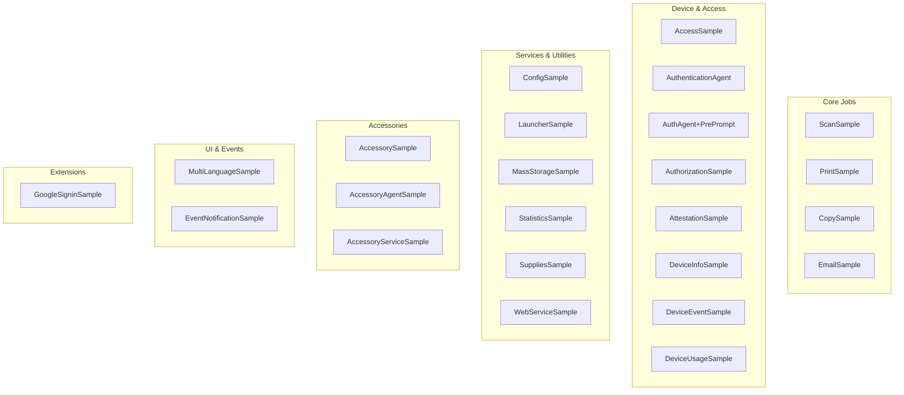

# Sample Apps Overview

> **Audience**: Workpath SDK developers
> **Version**: HP Workpath SDK v1.6.3

---

## 1. Overview

The SDK package provides **23 sample apps** in both Java and Kotlin. Each sample is a reference implementation for a specific SDK API domain.

| Category | Count | Path |
|----------|-------|------|
| Java Samples | 23 | `Samples/ExampleAPIServices/source/` |
| Kotlin Samples | 23 | `Samples_Kotlin/ExampleAPIServices/source/` |
| Java Extension | 1 | `Samples/ExampleExtensions/source/` |
| Kotlin Extension | 1 | `Samples_Kotlin/ExampleExtensions/source/` |
| Prebuilt APKs | 46 | `*/apks/` |
| Prebuilt HPKs | 46 | `*/hpk/` |

---

## 2. Complete Sample App List

### 2.1 Core Job Samples

| # | Sample | API Domain | Key APIs |
|---|--------|-----------|----------|
| 1 | **ScanSample** | Scanner | `ScannerService.submit()`, `ScanAttributes.MeBuilder`, `ScanAttributesCaps`, `JobService.AbstractJobletObserver` |
| 2 | **PrintSample** | Printer | `PrinterService.submit()`, `PrintFromStorageBuilder/HttpBuilder/UsbBuilder/StreamBuilder`, batch print |
| 3 | **CopySample** | Copier | `CopierService.submit()`, stored job (enumerate/release/delete), stamp, credentials |
| 4 | **EmailSample** | Email Helper | `EmailAttributes`, `SmtpAttributes`, `ProxyAttributes`, SMTP configuration and attachment sending |

### 2.2 Device & Access Samples

| # | Sample | API Domain | Key APIs |
|---|--------|-----------|----------|
| 5 | **AccessSample** | Access | `Principal` — read authenticated user information |
| 6 | **AuthenticationAgent** | Authentication | `AbstractAuthenticationService`, `SignInAction`, LDAP/Windows/PIN authentication |
| 7 | **AuthenticationAgentWithPrePrompt** | Authentication | AuthenticationAgent + pre-prompt UI |
| 8 | **AuthorizationSample** | Authorization | `Permission`, `SignInMethod`, `ConfigService`, permission setting/change monitoring |
| 9 | **AttestationSample** | Attestation | `AppToken`, `AttestationService` — app token verification |
| 10 | **DeviceInfoSample** | Device | `DeviceSettingsService` — model, serial, firmware, port enable/disable |
| 11 | **DeviceEventSample** | Device Events | `DeviceEventsService`, `AbstractDeviceEventsChangeObserver` — real-time event reception |
| 12 | **DeviceUsageSample** | Device Usage | Print/copy/fax usage — by media size, plex, and job category |

### 2.3 Service & Utility Samples

| # | Sample | API Domain | Key APIs |
|---|--------|-----------|----------|
| 13 | **ConfigSample** | Config | `ConfigService` — read/write app config, `EncryptedFile` (encrypted storage), print capabilities |
| 14 | **LauncherSample** | Launcher | `LauncherService`, `LaunchAction` — navigate home, launch app by UUID, HID events |
| 15 | **MassStorageSample** | Mass Storage | `MassStorageService` — USB file create/read/delete/rename, storage change detection |
| 16 | **StatisticsSample** | Statistics | Job statistics — total count, last job sequence, commit statistics, test job fragments |
| 17 | **SuppliesSample** | Supplies | Printer supply status — toner/drum level display |
| 18 | **WebServiceSample** | Web Services | `AbstractWebServices`, `HttpRequest/HttpResponse` — custom GET/POST/PUT/DELETE web endpoint |

### 2.4 Accessory Samples

| # | Sample | API Domain | Key APIs |
|---|--------|-----------|----------|
| 19 | **AccessorySample** | Accessory (HID) | `AccessoryService`, `HIDAccessoryInfo`, `HIDReport` — USB HID device read/write |
| 20 | **AccessoryAgentSample** | Accessory + Auth | `SignInAction` — accessory-based authentication agent |
| 21 | **AccessoryServiceSample** | Accessory + Auth | Accessory service authentication integration |

### 2.5 UI & Misc Samples

| # | Sample | API Domain | Key APIs |
|---|--------|-----------|----------|
| 22 | **MultiLanguageSample** | Localization | Multi-language/localization support demo |
| 23 | **EventNotificationSample** | Broadcast Events | `BroadcastReceiver` — Sleep/WakeUp, SignIn/Out, JobCompleted, ConfigChanged reception |

### 2.6 Extension Sample

| # | Sample | API Domain | Key APIs |
|---|--------|-----------|----------|
| — | **GoogleSigninSample** | External OAuth | Google Authorization Code + PKCE, Google Drive API, OkHttp3 — does not use Workpath SDK APIs |

---

## 3. Build Configuration

### 3.1 Java Samples

| Setting | Value |
|---------|-------|
| Gradle Plugin | `com.android.tools.build:gradle:7.4.2` |
| Gradle Version | 8.0 |
| compileSdkVersion | 31 |
| minSdkVersion | 31 |
| targetSdkVersion | 31 |
| Java compatibility | VERSION_11 (`sourceCompatibility`, `targetCompatibility`) |
| multiDexEnabled | true |
| versionName | `1.6.3 (20251111)` |
| versionCode | 17 |
| Signing | `debug.keystore` (password: `android`) |

### 3.2 Kotlin Samples

| Setting | Value |
|---------|-------|
| Kotlin Plugin | `org.jetbrains.kotlin:kotlin-gradle-plugin:1.8.20` |
| Additional Plugins | `kotlin-android` |
| buildFeatures | `viewBinding true` |
| kotlinOptions | `jvmTarget = "11"` |
| (rest) | Same as Java Samples |

### 3.3 Common Dependencies

```gradle
// Common across all samples
implementation 'androidx.appcompat:appcompat:1.4.1'
implementation 'androidx.multidex:multidex:2.0.0'  // Kotlin samples use 2.0.1
implementation 'com.google.android.material:material:1.5.0'
implementation 'androidx.preference:preference:1.2.0'  // Kotlin samples use 1.1.1
implementation project(':WorkpathLib')

// Kotlin additions
implementation 'androidx.fragment:fragment-ktx:1.5.5'
implementation 'org.jetbrains.kotlinx:kotlinx-coroutines-core:1.7.2'
implementation 'org.jetbrains.kotlinx:kotlinx-coroutines-android:1.7.2'
implementation 'androidx.lifecycle:lifecycle-runtime-ktx:2.5.1'
```

### 3.4 Source Layout (Non-standard)

```gradle
sourceSets {
    main {
        manifest.srcFile 'AndroidManifest.xml'
        java.srcDirs = ['src']
        res.srcDirs = ['res']
        assets.srcDirs = ['assets']
    }
}
```

> Uses a flat structure instead of the standard Android `src/main/java`, `src/main/res` layout.

---

## 4. Prebuilt Artifacts

All samples ship with **prebuilt APKs and HPKs** alongside source code:

```
ExampleAPIServices/
├── apks/
│   ├── ScanSample.apk
│   ├── PrintSample.apk
│   └── ... (23 total)
├── hpk/
│   ├── ScanSample.hpk
│   ├── PrintSample.hpk
│   └── ... (23 total)
└── source/
    └── ... (source code)
```

> **SDK developer note**: At release time, the build → APK → HPKTool conversion pipeline must be executed for 23 × 2 (Java + Kotlin) = **92 binaries**.

---

## 5. Functional Category Map



---

*→ Next: [Java Samples](Java_Samples.md)*
