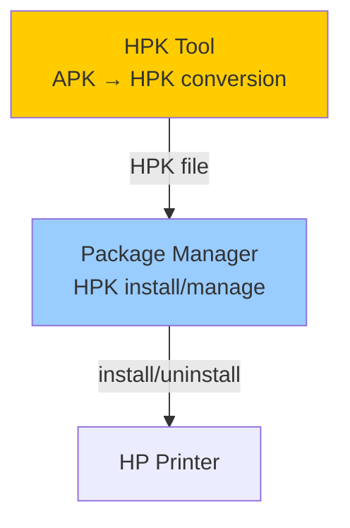

# HPK Tool

> **Audience**: Workpath SDK developers
> **Version**: HP Workpath SDK v1.6.3

---

## 1. Overview

HPK Tool is a command-line tool that converts Android APKs into the **HPK (HP Workpath Package)** format. HPK is the only installable app package format for HP printers and is processed by the Package Manager.

| Property | Value |
|----------|-------|
| Distribution format | ZIP archive |
| Supported platforms | Windows, Linux |
| User Guide | `HP WorkpathSDK-HPKTool-UserGuide_v1.6.3.pdf` |

---

## 2. Package Contents

```
Tools/
├── HP WorkpathSDK-HPKTool-UserGuide_v1.6.3.pdf   ← User guide
└── hpktool/
    ├── HPKTool_win.zip                             ← Windows version
    └── HPKTool_linux.zip                           ← Linux version
```

---

## 3. APK → HPK Conversion Flow


### Conversion Process

1. **Build APK** — Generate APK using Android Studio or Gradle
2. **Generate HPK** — Convert APK to HPK using HPKTool
   - Adds metadata (UUID, vendor, platform version, etc.)
   - Wraps in HPK structure
3. **Install** — Upload HPK to printer for Package Manager installation

---

## 4. HPK Metadata

Metadata included in the HPK package:

| Field | Description | Example |
|-------|-------------|---------|
| UUID | Unique app identifier | `550e8400-e29b-41d4-a716-446655440000` |
| App Name | Display name | `ScanSample` |
| Vendor | Publisher | `HP Inc.` |
| Package Name | Android package name | `com.hp.workpath.sample.scansample` |
| Platform Version | Target platform version | `31.9` |
| Home Screen | Whether to show on home screen | `true/false` |

---

## 5. SDK Developer Responsibilities

### 5.1 HPK Generation at Release

HPKs for **all sample APKs** must be generated for inclusion in the release package:

```
Total HPK count = 23 (Java) + 23 (Kotlin) = 46
```

### 5.2 HPK Tool Packaging

At release time:
- Verify both Windows and Linux builds function correctly
- Compress into ZIP archives
- Update User Guide PDF (version number, changes)

### 5.3 HPK Tool and Package Manager Compatibility

The HPK format produced by HPK Tool is processed by Package Manager. When Platform changes modify the HPK format:
- HPK Tool update required
- Backward compatibility verification with previous HPK versions
- User Guide update

---

## 6. Relationship with Platform



> HPK Tool is part of the SDK package, but installation/execution is handled by the Workpath Platform's Package Manager. See Workpath_Dune_KB's [Package_Manager.md](../../Workpath_Dune_KB/02_Components/Package_Manager.md) for details.

---

*→ Next: [Simulator](Simulator.md)*
