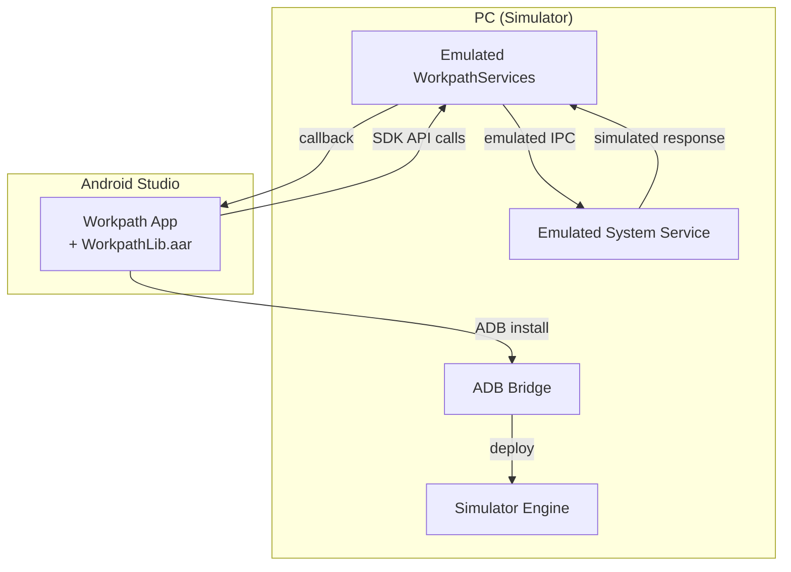

# Simulator

> **Audience**: Workpath SDK developers
> **Version**: HP Workpath SDK v1.6.3

---

## 1. Overview

The Workpath SDK Simulator provides a development and testing environment for Workpath apps **without requiring a physical HP printer**. It runs on Windows and emulates printer hardware behavior.

| Property | Value |
|----------|-------|
| Installer | `SetupWorkpathSDKSimulator_v1.6.3.exe` |
| Supported OS | Windows |
| User Guide | `HP WorkpathSDK-Simulator-UserGuide_v1.6.3.pdf` |

---

## 2. Package Contents

```
HPWorkpathSDK_Simulator_v1.6.3/
├── HP WorkpathSDK-Simulator-UserGuide_v1.6.3.pdf   ← User guide
├── SetupWorkpathSDKSimulator_v1.6.3.exe              ← Windows installer
└── THIRD-PARTY-LICENSES.txt                          ← Open source license
```

> The Simulator is distributed as a **separate package** from the main SDK package (`HPWorkpath_v1.6.3`).

---

## 3. Purpose & Use Cases

### 3.1 Shortened Development Cycle

| Without (Physical Printer) | With (Simulator) |
|----------------------------|------------------|
| Printer access required | Test directly on PC |
| APK → HPK → transfer to printer | APK → run in Simulator |
| Long feedback loop | Rapid iterative development |
| Hardware sharing contention | Independent testing in personal environment |

### 3.2 Primary Use Cases

1. **App development** — Developer and debug SDK API call logic
2. **UI testing** — Verify printer screen layouts
3. **Job simulation** — Test Scan/Print/Copy job workflows
4. **Event testing** — Test Sleep/WakeUp, SignIn/Out event triggers
5. **Automated testing** — Automated tests in CI/CD pipelines

---

## 4. Architecture



---

## 5. Simulator vs Physical Printer

| Feature | Simulator | Physical Printer |
|---------|-----------|-----------------|
| Scan Job | Simulated result | Actual scan |
| Print Job | Simulated | Actual print |
| Copy Job | Simulated | Actual copy |
| USB Accessory | Limited | Full support |
| Mass Storage | Limited | Full support |
| Device Events | Supported | Supported |
| Authentication | Supported | Supported |
| Network | Local | Actual network |
| Performance | Reference only | Real-world environment |

> Final testing must always be performed on a physical printer.

---

## 6. Signing Differences

The Simulator uses **different signing keys** than the physical printer:

| Environment | Key |
|-------------|-----|
| Physical Device | `platform.keystore` |
| Simulator | `emulator.keystore` (WorkpathServices) / `platform.jks` (System) |

> For detailed signing configuration, see Workpath_Dune_KB's [Security_Model.md](../../Workpath_Dune_KB/01_Concepts/Security_Model.md).

---

## 7. SDK Developer Responsibilities

### 7.1 Simulator Release

- [ ] Build Simulator (Windows EXE)
- [ ] Verify emulation behavior — confirm all SDK API calls work correctly
- [ ] Update User Guide PDF
- [ ] Update THIRD-PARTY-LICENSES.txt
- [ ] Verify all 23 sample apps run correctly on Simulator

### 7.2 When Adding New APIs

When adding new SDK APIs, the corresponding emulation must also be implemented in the Simulator:
1. Implement API emulation logic
2. Define simulated response data
3. Validate with the sample app that uses the new API

---

*→ Next: [Documentation Guide](Documentation_Guide.md)*
